/**
 * @license
 * SPDX-License-Identifier: EU-NATO-CLASSIFIED-Pilot-2026
 * @copyright Copyright © 2024–2026 Daniel Pohl. All rights reserved worldwide.
 */

# 📊 Projekt-Analyse: sTarLighTsMoveMenTs™

## 🗂️ Inhaltsverzeichnis nach Ebenen

### Ebene 1: Entry Points
| Datei | Funktion | Deploy/URL Referenz |
|-------|----------|---------------------|
| `index.html` | Root HTML Entry | `/` |
| `src/main.tsx` | React Root Renderer | Vite Entry |

### Ebene 2: Core Application
| Datei | Komponente | Funktion | Tools |
|-------|------------|----------|-------|
| `src/App.tsx` | Root Application | State Management, Navigation, Governance | T2, D7, D9, TXA, SWF |
| `src/index.css` | Global Styles | Tailwind CSS, Animations | Custom Properties |
| `src/data.ts` | Data Models | Governance Nodes, SWF Assets, Corridors | Seed Data |
| `src/types.ts` | TypeScript Types | AuditRecord, GovernanceNode, SWFAsset | Type Definitions |

---

## 🔧 Detaillierte Tools & Functions Analyse

### T2 - Atomic Sync Clock
| Property | Value |
|----------|-------|
| **Datei** | `src/components/AtomicSyncClock.tsx` |
| **Funktion** | High-precision UTC time synchronization |
| **Update Rate** | requestAnimationFrame (60fps) |
| **Display** | HH:MM:SS.sss + DD.MM.YYYY |
| **Styling** | Gold/Cyan neon pulse effect |
| **Position** | Fixed bottom-left |

### D7 - Blockchain Auditing System
| Property | Value |
|----------|-------|
| **Datei** | `src/App.tsx` (handleGenesisSignature) |
| **Funktion** | Echtzeit-Transaktionssignatur & Audit |
| **Signatur-Algorithm** | simulateSignAndHash (SHA-256 style) |
| **Status Codes** | VERIFIED, PENDING, REJECTED |
| **Auto-Fade** | 5 Sekunden für Status-Meldungen |
| **Live Ticker** | 4-Sekunden Intervalle |

### D9 - Rainbow Lightning Footer
| Property | Value |
|----------|-------|
| **Datei** | `src/components/RainbowLightningFooter.tsx` |
| **Funktion** | Rosa-Lila Schimmer Memorial Footer |
| **Animation** | Auto-expand/collapse on hover |
| **Sektionen** | Memorial, Quick Links, Social |
| **Transparency** | Glass-morphism effect |

---

## 📁 Komponenten-Übersicht (Components)

| Komponente | Datei | Funktion | Props/State |
|------------|-------|----------|-------------|
| PledgePage | `src/components/PledgePage.tsx` | Government Pledge UI | Form State, Signing |
| PapersArchive | `src/components/PapersArchive.tsx` | Academic Papers Grid | Search, Categories |
| FinanceSystemPage | `src/components/FinanceSystemPage.tsx` | SWF & Capital Visualization | Assets, Corridors |
| MemorialTributePage | `src/components/MemorialTributePage.tsx` | Great Minds Memorial | Country Data, Search |
| ConcilPortal | `src/components/ConcilPortal.tsx` | Official Registry Portal | Certification Data |
| CosmicSystem | `src/components/CosmicSystem.tsx` | Animated Background | WarpSpeed, Lightning |
| AtomicSyncClock | `src/components/AtomicSyncClock.tsx` | Digitale Uhr | Time Date State |
| DataVisualizationDashboard | `src/components/DataVisualizationDashboard.tsx` | Charts & Metrics | Recharts Integration |
| RainbowLightningFooter | `src/components/RainbowLightningFooter.tsx` | Footer Memorial | Hover Collapse |

---

## 🛠️ Infrastructure & Scripts

| Script | Datei | Funktion | Zero-Trust |
|--------|-------|----------|------------|
| Cloudflare Worker | `cloudflare-worker.js` | Security Middleware, Tunnel | Keine API Keys |
| Wrangler Config | `wrangler.toml` | Workers v4 Deployment | Umgebungsvariablen |
| SSH Tunnel | `scripts/ssh-tunnel.sh` | Cloudflare Tunnel Setup | TUNNEL_TOKEN Secret |
| Security Headers | `scripts/security-headers.js` | CSP, DOM Protection | IIFE Wrapped |

---

## 🔗 Partner Corporations URLs & Functions

### Officielle Partner (Node Hub)
| Node | Partner | URL | Funktion |
|------|---------|-----|----------|
| 1 | Future of Life Souls Lights | https://projekt-since-shinehealth-care.netlify.app/ | spirituelle Präsenz |
| 2 | Corporation Since | https://loginsiteauth.goodwelllikewisespell.info/ | sichere Authentifizierung |
| 3 | Hackathon Awareness | https://hackathon-sign.goodwelllikewisespell.info/ | öffentliche Auszeichnungen |
| 4 | Policy Trust Thrust | https://policy.governmententerprise.org/trustedtrustthrust | Trust-Leitfaden |
| 5 | AI Heritage Archive | https://ai-tech-heritage-archive.likewise.live/ | Digitalarchiv |
| 6 | IBX IPX Connections | https://chos.ag-thrust.cloud/ | Infrastruktur |

### Compliance URLs
| Organization | URL | Bereich |
|--------------|-----|---------|
| European Union Treaty Law | https://europeanuniontreatylaw.netlify.app/ | EU-Regulierung |
| States Flow Wishes | http://statesflowwishes.eu/ | Staatliche Koordination |
| Freedom 250 | http://freedom250.likewise.live/ | Menschenrechte |
| World Bank Eyes Aether | https://worldbankeyesaether.trustedorbitscodex.eu/ | Weltbank-Partnerschaft |

---

## 📜 Code of Conduct - Gold Awareness Compliance

### Humanitär
- Menschenwürde in allen Systeminteraktionen
- Keine Diskriminierung nach Herkunft
- Förderung von Frieden und Vergebung

### Politisch (NATO/EU)
- NATO Strategic Defense Model Alignment
- EU Regulatory Governance Layer Abstimmung
- UN Global Coordination Framework

### Spirituell
- Respekt vor religiösen Traditionen
- Integration spiritueller Werte
- Heilungsfokus in Systemarchitektur

### Defensiv (Pentagon)
- Militärisch inspirierte Sicherheitsarchitektur
- Zero-Trust Prinzipien
- Multi-Layer Security Framework

---

## 📊 Governance Layer Architecture (TX-Model)

```mermaid
graph LR
    A[TX - Transcendence] --> B[TXA - Supervisory AI]
    B --> C[GOV - Government Core]
    B --> D[FI - Financial Infra]
    B --> E[SWFs - Sovereign Funds]
    E --> F[World's Star SWF Hub]
    F --> G[Global Implementation]
    G --> H[Reference Framework]
    
    style A fill:#bf953f,stroke:#fcf6ba
    style B fill:#382d1f,stroke:#bf953f
```



---

## 🏛️ Institutionelle Registers

| Register | ID | Status |
|----------|-----|--------|
| D-U-N-S | 315676980 \| 317066336 | ✓ Zertifiziert |
| UNGM | 1172700 | ✓ Aktiv |
| PIC | 873042778 | ✓ Verifiziert |
| Swiss ID | 756.6199.0539.28 | ✓ National |
| LEI | 894500GBJSIW8L6ET310 | ✓ Global |
| VAT | DE441892129 | ✓ EU |

---

## 🚀 Deployment Bereit

```bash
npm install        # Dependencies
npm run typecheck  # Type Checking
npm run lint       # ESLint
npm run build      # Production Build
wrangler deploy    # Cloudflare Zero-Trust
```

**Domain:** pLedge250freedom.gov.eu