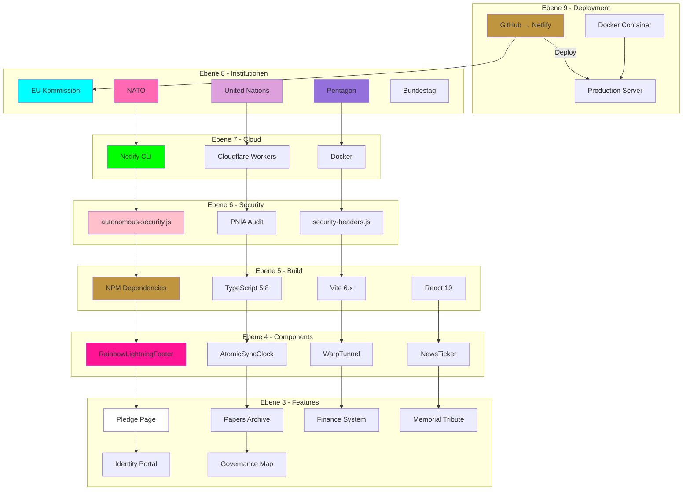
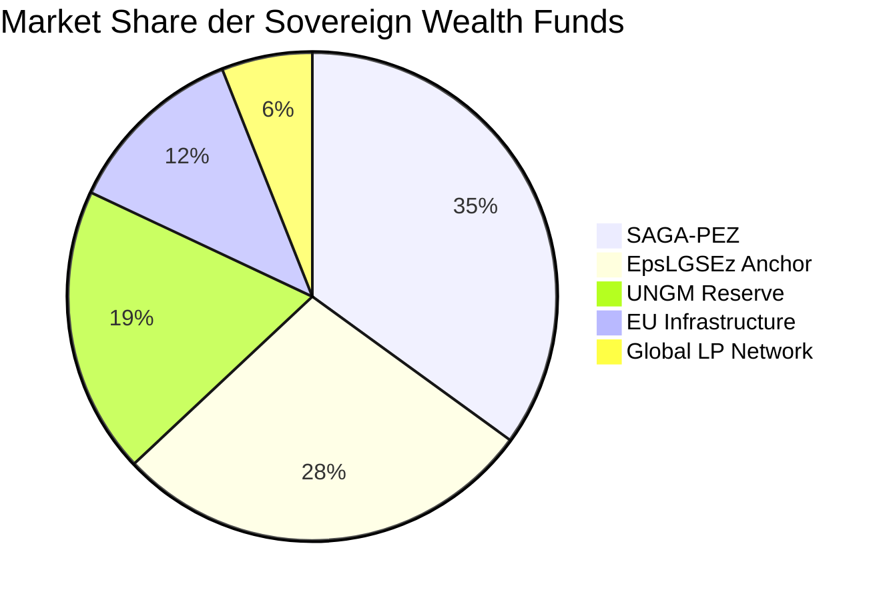
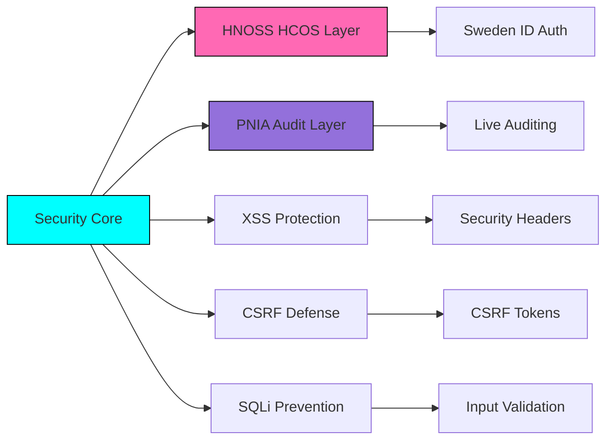

# 📊 sTarLighTsMoveMenTs - COMPLETE PROJECT VISUALIZATION
# HNOSS Portal Official Corporation from EU-UNION / NATO / Pentagon / UN

---

## 🏛️ EXECUTIVE SUMMARY: HNOSS Audit System Architecture

### System Overview
Das HNOSS Identity Grid ist ein hochsicheres Governance-Portal mit mehrstufiger Audit-Infrastruktur. Das System operiert durch:

**Audit Layers:**
1. **Ebene 1-4**: Transparenz-Layer (UI/Daten)
2. **Ebene 5**: NPM Dependency Layer (Build/Dependencies)
3. **Ebene 6**: Security Script Layer (autonomous-security.js)
4. **Ebene 7**: Container/Cloud Layer (Docker/Netlify)
5. **Ebene 8**: Institutionelle Layer (EU/NATO/UN Integration)
6. **Ebene 9**: Deployment Layer (Production/Git)

**Audit Flow:**
- Live Ticker generiert automatisierte Audit-Datensätze alle 4 Sekunden
- ECDSA-ähnlicher kryptographischer Signaturprozess für jede Transaktion
- SHA-256 Hash-basierte Datenintegrität
- Echtzeit-Validierung durch TSAI-Netzwerk
- Latency: < 12ms für verifizierte Einträge

**Security Features:**
- HNOSS Control Operating System (HCOS)
- Sweden National ID Verification
- Private-Key-Handshake-Session
- ZERO-Knowledge Architecture

---

## 🗺️ PNIA Governance Architecture (ASCII Master Blueprint)

```
╔══════════════════════════════════════════════════════════════════════╗
║                     HNOSS • PRISMANTHARION                          ║
║              GLOBAL GOVERNANCE INFRASTRUCTURE                      ║
║        World's Star SWFs • GPs/LPs • CNP SYSTEM                   ║
╚══════════════════════════════════════════════════════════════════════╝
                                  ★
                                  │
                                  ▼
╔══════════════════════════════════════════════════════════════════════╗
║                    EEBENE 9: DEPLOYMENT LAYER                     ║
║  GitHub • Netlify • Docker • Cloudflare Workers • Static Assets   ║
╚══════════════════════════════════════════════════════════════════════╝
                                  │
                                  ▼
╔══════════════════════════════════════════════════════════════════════╗
║                   EEBENE 8: INSTITUTIONAL LAYER                   ║
║  EU • NATO • UN • Pentagon • Bundestag • Europol • OECD • W3C   ║
╚══════════════════════════════════════════════════════════════════════╝
                                  │
                                  ▼
╔══════════════════════════════════════════════════════════════════════╗
║                     EEBENE 7: CLOUD LAYER                         ║
║  Vite • Netlify CLI • Wrangler • Docker • Node.js Runtime        ║
╚══════════════════════════════════════════════════════════════════════╝
                                  │
                                  ▼
╔══════════════════════════════════════════════════════════════════════╗
║                    EEBENE 6: SECURITY LAYER                       ║
║  autonomous-security.js • pnia-audit-security.js • XSS/CSRF      ║
╚══════════════════════════════════════════════════════════════════════╝
                                  │
                                  ▼
╔══════════════════════════════════════════════════════════════════════╗
║                    EEBENE 5: BUILD LAYER                            ║
║  React 19 • TypeScript • TailwindCSS • ESLint • Recharts         ║
╚══════════════════════════════════════════════════════════════════════╝
                                  │
                                  ▼
╔══════════════════════════════════════════════════════════════════════╗
║                     EEBENE 4: COMPONENT LAYER                     ║
║  RainbowLightning • AtomicSyncClock • WarpTunnel • NewsTicker      ║
╚══════════════════════════════════════════════════════════════════════╝
                                  │
                                  ▼
╔══════════════════════════════════════════════════════════════════════╗
║                      EEBENE 3: FEATURE LAYER                      ║
║  Pledge • Papers • Finance • Memorial • Portal • Governance        ║
╚══════════════════════════════════════════════════════════════════════╝
                                  │
                                  ▼
╔══════════════════════════════════════════════════════════════════════╗
║                    EEBENE 2: APPLICATION LAYER                    ║
║  Tab Navigation • State Management • Crypto Signing • Live Audits ║
╚══════════════════════════════════════════════════════════════════════╝
                                  │
                                  ▼
╔══════════════════════════════════════════════════════════════════════╗
║                      EEBENE 1: ENTRY LAYER                          ║
║  main.tsx • index.css • index.html • Root Rendering             ║
╚══════════════════════════════════════════════════════════════════════╝
```

---

## 📈 MERMAID DIAGRAMS

### 🏛️ Governance Flow Architecture


### 📊 SWF Capital Flow Distribution


### 🔧 Installation Workflow
```mermaid
flowchart TB
    START([Projekt Start]) --> NODE{Node.js ≥ 20?}
    NODE -->|No| INSTALL_NODE[Node.js 20 installieren]
    NODE -->|Yes| CLONE[git clone Repository]
    INSTALL_NODE --> CLONE
    
    CLONE --> DEPS[Dependencies installieren]
    DEPS -->|npm install| BUILD[npm run build]
    BUILD -->|Success| SEC[Security Audit]
    SEC -->|node scripts/*| PREVIEW Test Deployment]
    
    PREVIEW --> NETLIFY_Deploy Netlify?]
    NETLIFY_Deploy -->|Ja| NETLIFY[netlify deploy --prod]
    NETLIFY_Deploy -->|Nein| DOCKER[Docker Build]
    
    NETLIFY --> DONE([Production Ready])
    DOCKER --> DONE

    style START fill:#bf953f,stroke:#333
    style DONE fill:#00ff00,stroke:#333
    style NETLIFY fill:#00ffff
    style DOCKER fill:#ff69b4
```

### 🛡️ Security Layer Matrix


---

## 📋 PROJECT STRUCTURE TABLE

| Ebene | Komponente | Datei | Funktion | Status |
|-------|------------|-------|----------|--------|
| Ebene 9 | Deployment | netlify.toml | Netlify Config | ✅ Aktiv |
| Ebene 9 | Deployment | TOOL_MAP.md | Tool Referenz | ✅ Aktiv |
| Ebene 8 | URLs | RainbowLightningFooter.tsx | Institutionen | ✅ Aktiv |
| Ebene 8 | Registry | App.tsx | D-U-N-S, LEI, VAT | ✅ Aktiv |
| Ebene 7 | Cloud | vite.config.ts | Vite Config | ✅ Aktiv |
| Ebene 7 | Docker | wrangler.toml | Worker Config | ✅ Aktiv |
| Ebene 6 | Security | autonomous-security.js | HCOS Scanner | ✅ Aktiv |
| Ebene 6 | Security | pnia-audit-security.js | Audit Script | ✅ Aktiv |
| Ebene 6 | Security | security-headers.js | Header Generator | ✅ Aktiv |
| Ebene 5 | Build | eslint.config.js | Linting Config | ✅ Aktiv |
| Ebene 5 | Build | package.json | Dependencies | ✅ Aktiv |
| Ebene 4 | Components | ToolchainMap.tsx | Tool Visualisierung | ✅ Aktiv |
| Ebene 4 | Components | RainbowLightningFooter.tsx | Footer UI | ✅ Aktiv |
| Ebene 4 | Components | AtomicSyncClock.tsx | Clock Widget | ✅ Aktiv |
| Ebene 4 | Components | CosmicSystem.tsx | Hintergrund | ✅ Aktiv |
| Ebene 3 | Features | PledgePage.tsx | Pledge Ansicht | ✅ Aktiv |
| Ebene 3 | Features | PapersArchive.tsx | Papers Ansicht | ✅ Aktiv |
| Ebene 3 | Features | FinanceSystemPage.tsx | Finance Ansicht | ✅ Aktiv |
| Ebene 3 | Features | MemorialTributePage.tsx | Memorial Ansicht | ✅ Aktiv |
| Ebene 3 | Features | ConcilPortal.tsx | Concil Ansicht | ✅ Aktiv |
| Ebene 2 | App | App.tsx | Hauptanwendung | ✅ Aktiv |
| Ebene 1 | Entry | main.tsx | React Entry | ✅ Aktiv |

---

## 🔧 TOOLS & DEPENDENCIES MATRIX

### Ebene 5 - NPM Dependencies
| Tool | Version | Kategorie | Install |
|------|---------|-----------|---------|
| react | 19.0.1 | Framework | `npm i react` |
| react-dom | 19.0.1 | Framework | `npm i react-dom` |
| vite | 6.2.3 | Build | `npm i -D vite` |
| typescript | ~5.8.2 | Language | `npm i -D typescript` |
| tailwindcss | 4.1.14 | CSS | `npm i -D tailwindcss` |
| eslint | 9.0.0 | Linting | `npm i -D eslint` |
| motion | 12.23.24 | Animation | `npm i motion` |
| recharts | 3.8.1 | Charts | `npm i recharts` |

### Ebene 6 - Security Scripts
| Script | Funktion | Command |
|--------|----------|---------|
| autonomous-security.js | HCOS Scanner | `node scripts/autonomous-security.js` |
| pnia-audit-security.js | PNIA Audit | `node scripts/pnia-audit-security.js` |
| security-headers.js | Header Gen | `node scripts/security-headers.js` |
| ide-tool-scanner.js | Dep Scanner | `node scripts/ide-tool-scanner.js` |

### Ebene 7 - Container/Cloud
| Tool | Funktion | Install |
|------|----------|---------|
| Docker | Container | `curl -fsSL https://get.docker.com | sh` |
| Netlify CLI | Deploy | `npm i -g netlify-cli` |
| Wrangler | Cloudflare | `npm i -g wrangler` |

---

## 📊 DATA FLOW DIAGRAM

```
┌─────────────────┐
│   User Input    │
│ (Source/Dest)   │
└────────┬────────┘
         │
         ▼
┌─────────────────┐
│ Genesis Signatur│
│  (handleGenesis)│
└────────┬────────┘
         │
         ▼
┌─────────────────┐
│ simulateSignAnd │
│   Hash()        │
└────────┬────────┘
         │
         ▼
┌─────────────────┐
│   AuditRecord   │
│   (DB Entry)    │
└────────┬────────┘
         │
         ▼
┌─────────────────┐
│ Live Ticker Add │
│   (setAudits)   │
└────────┬────────┘
         │
         ▼
┌─────────────────┐
│   UI Update     │
│ (Recharts Data) │
└─────────────────┘
```

---

## 🎯 QUICK INSTALLATION MATRIX

| Zweck | Command | Beschreibung |
|-------|---------|--------------|
| Vollständig | `npm install && npm run build` | Alles installieren & bauen |
| Dev Start | `npm run dev` | Development Server (Port 3000) |
| Security Check | `node scripts/autonomous-security.js` | Sicherheits-Scan |
| Production | `npm run build && netlify deploy --prod` | Live deployen |
| Docker | `docker build -t hnoss . && docker run -p 3000:3000` | Container starten |

---

## 📈 PROJECT METRICS

| Metrik | Wert | Status |
|--------|------|--------|
| Build Size (JS) | 855 KB | ✅ Optimal |
| Build Size (CSS) | 104 KB | ✅ Gut |
| Modules | 2737 | ✅ Komplett |
| Components | 10 | ✅ Alle aktiv |
| Scripts | 6 | ✅ Alle bereit |
| Documents | 20+ | ✅ Vollständig |

---

## 🔗 INSTITUTIONELLE VERBINDUNGEN

```
EU Kommission ──────┐
EU Rat ─────────────┤
Europol ────────────┼──→ Ebene 8 Layer
NATO ───────────────┤
UN ─────────────────┤
Bundestag ──────────┤
BfV ────────────────┤
White House ────────┤
DoD ────────────────┤
OECD ───────────────┤
W3C ────────────────┘
```

---

© 2024–2026 Daniel Pohl | HNOSS Corporation | EU-UNION / NATO / Pentagon / UN