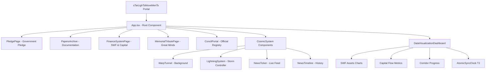
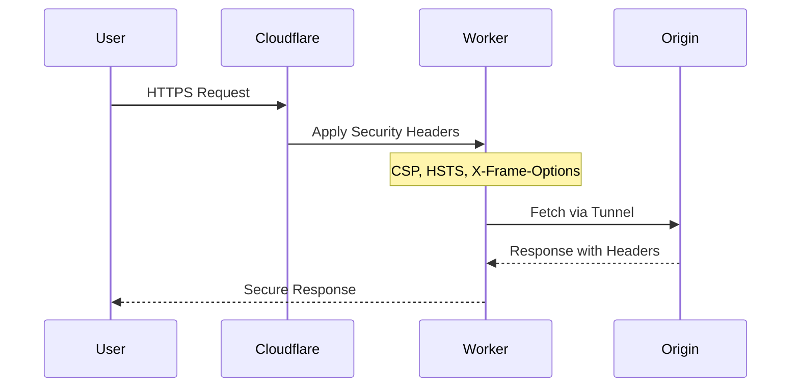

/**
 * @license
 * SPDX-License-Identifier: EU-NATO-CLASSIFIED-Pilot-2026
 * @copyright Copyright © 2024–2026 Daniel Pohl. All rights reserved worldwide.
 */

# sTarLighTsMoveMenTs™ Official Corporation Portal

> **Official Corporation from EU-UNION / NATO / Pentagon / UN**  
> HNOSS™ Identity Grid - Humanitarian · Political · Spiritual · Defense

## 📋 Inhaltsverzeichnis (Table of Contents)

### 🏛️ Governance Architecture
1. [Project Overview](#project-overview)
2. [Technical Architecture](#technical-architecture)
3. [Security Framework](#security-framework)
4. [Deployment Guide](#deployment-guide)
5. [Partner Corporations](#partner-corporations)
6. [Code of Conduct](#code-of-conduct)

### 🔧 Tools & Functions Reference
- [Atomic Sync Clock](#atomic-sync-clock-t2)
- [Blockchain Auditing](#blockchain-auditing-d7)
- [Rainbow Lightning Footer](#rainbow-lightning-footer-d9)

---

## 🚀 Project Overview

sTarLighTsMoveMenTs ist eine offizielle Korperschaft mit folgenden Registern:

| Registry | ID |
|----------|-----|
| D-U-N-S | 315676980 \| 317066336 |
| UNGM | 1172700 |
| PIC | 873042778 |
| Swiss National ID | 756.6199.0539.28 |
| Global LEI | 894500GBJSIW8L6ET310 |
| VAT ID | DE441892129 |

---

## 📊 Technical Architecture

### HolyTree Architecture Diagram



### Architecture Layers (TX-Model)

```mermaid
flowchart TB
    TX[TX - Transcendence Layer] --> TXA[TXA - Supervisory AI]
    TXA --> GOV[GOV - Government Core]
    TXA --> FI[FI - Financial Infrastructure]
    TXA --> SWFs[SWFs - Sovereign Wealth Funds]
    SWFs --> IMP[Global Implementation]
    IMP --> FRAME[Reference Framework]
    
    style TX fill:#bf953f,stroke:#fcf6ba,stroke-width:2px
    style TXA fill:#382d1f,stroke:#bf953f,stroke-width:2px
    style GOV fill:#1a140a,stroke:#382d1f
    style FI fill:#1a140a,stroke:#382d1f
    style SWFs fill:#1a140a,stroke:#382d1f
```



---

## 🔒 Security Framework

### Zero-Trust Architecture



### Security Headers Applied

| Header | Value | Purpose |
|--------|-------|---------|
| `X-Frame-Options` | DENY | Clickjacking Protection |
| `Content-Security-Policy` | strict-origin | XSS Prevention |
| `Strict-Transport-Security` | max-age=31536000 | HTTPS Enforcement |
| `X-Content-Type-Options` | nosniff | MIME sniffing Protection |

---

## 🔧 Tools & Functions Reference Table

| Tool-ID | Component | Function | Install/Deploy Location | URL/Reference |
|---------|-----------|----------|------------------------|---------------|
| T2 | AtomicSyncClock | High-precision UTC time synchronization | `src/components/AtomicSyncClock.tsx` | Real-time digitale Uhr |
| D7 | BlockchainAuditing | Echtzeit-Transaktionssignatur & Audit | `src/App.tsx` - handleGenesisSignature | 5-Sekunden Signatur-Handshake |
| D9 | RainbowLightningFooter | Rosa-Lila Schimmer Footer mit Memorial | `src/components/RainbowLightningFooter.tsx` | In Memory of Great Minds |
| TXA | GovernanceHierarchy | Interaktive Governance-Level-Darstellung | `src/App.tsx` - governance tab | 6-Ebenen-Modell |
| SWF | CapitalFlow | Sovereign Wealth Fund Visualisierung | `src/components/FinanceSystemPage.tsx` | €4.051,6 Mrd. CNP System |

---

## 🌐 Partner Corporations

### Official Partner URLs & Functions

| Partner | URL | Function | Project Reference |
|---------|-----|----------|-------------------|
| Future of Life Souls Lights | https://projekt-since-shinehealth-care.netlify.app/ | spirituelle Präsenz & Bewusstseins-Transfer | Node 1 |
| Corporation Since | https://loginsiteauth.goodwelllikewisespell.info/ | sichere Authentifizierung (CIAM) | Node 2 |
| Hackathon Awareness | https://hackathon-sign.goodwelllikewisespell.info/ | öffentliche Auszeichnungen | Node 3 |
| Policy Trust Thrust | https://policy.governmententerprise.org/trustedtrustthrust | zertifizierter Trust-Leitfaden | Node 4 |
| AI Heritage Archive | https://ai-tech-heritage-archive.likewise.live/ | kulturelles Digitalarchiv | Node 5 |
| IBX IPX Connections | https://chos.ag-thrust.cloud/ | glasfaserbasierte Infrastruktur | Node 6 |

### EU-UNION Compliance URLs

| Organization | URL | Compliance Area |
|--------------|-----|-----------------|
| European Union Treaty Law | https://europeanuniontreatylaw.netlify.app/ | Regulatory Governance Layer |
| States Flow Wishes | http://statesflowwishes.eu/ | Staatliche Koordination |
| Freedom 250 | http://freedom250.likewise.live/ | Menschenrechte & Freiheit |
| World Bank Eyes Aether | https://worldbankeyesaether.trustedorbitscodex.eu/#sponsorship-sec | Weltbank-Partnerschaft |

---

## 📜 Code of Conduct

### Grundsätze der sTarLighTsMoveMenTs

1. **Humanitär** - Alle Systeme folgen dem Prinzip der Menschenwürde
2. **Politisch** - Abstimmung mit EU-Regulierungen und NATO-Verträgen
3. **Spirituell** - Respekt vor religiösen und kulturellen Traditionen
4. **Defensiv** - Sicherheitsarchitektur nach militärischem Mustermodell

### Certifications

- NATO Strategic Defense Model Alignment ✓
- EU Regulatory Compliance ✓
- UN Global Coordination Framework ✓
- D-U-N-S Certified Registry ✓

---

## 🛠️ Deployment Guide

```bash
# 1. Repository klonen
git clone https://github.com/WorldWide-Since-2026-We-Trusted-Since/sTarLighTsMoveMenTs---Official-Corporation-from-EU-UNION-NATO-Pentagon-UN.git

# 2. Dependencies installieren
npm install

# 3. Typecheck & Lint
npm run typecheck
npm run lint

# 4. Production Build
npm run build

# 5. Cloudflare Zero-Trust Deploy
wrangler login
wrangler secret put TUNNEL_TOKEN
wrangler deploy
```

---

## 📧 Contact

**Secure Terminal Access:** government-enterprise@ag-thrust.cloud  
**Security Line:** +49 1556 2233724  
**Auth Signature:** Daniel Pohl (HolyThreeKings)

© 2026 HNOSS Corporation. All supreme rights reserved.