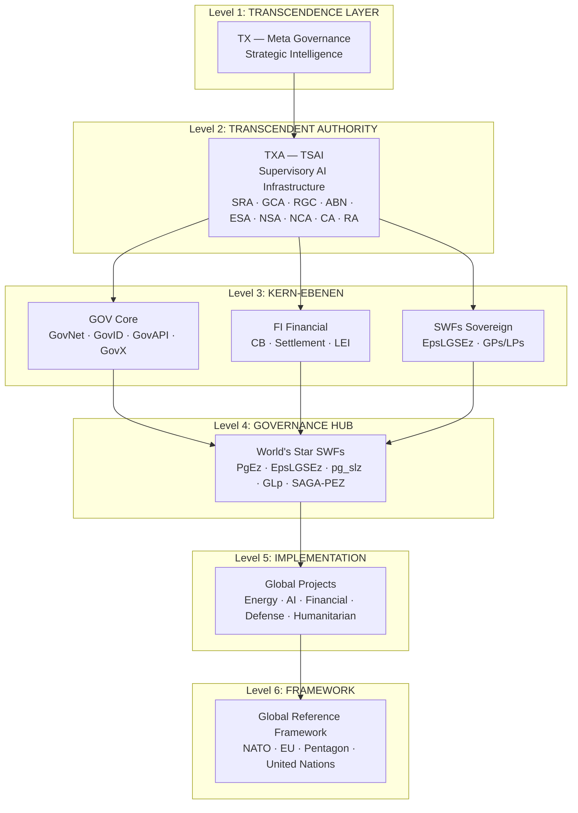
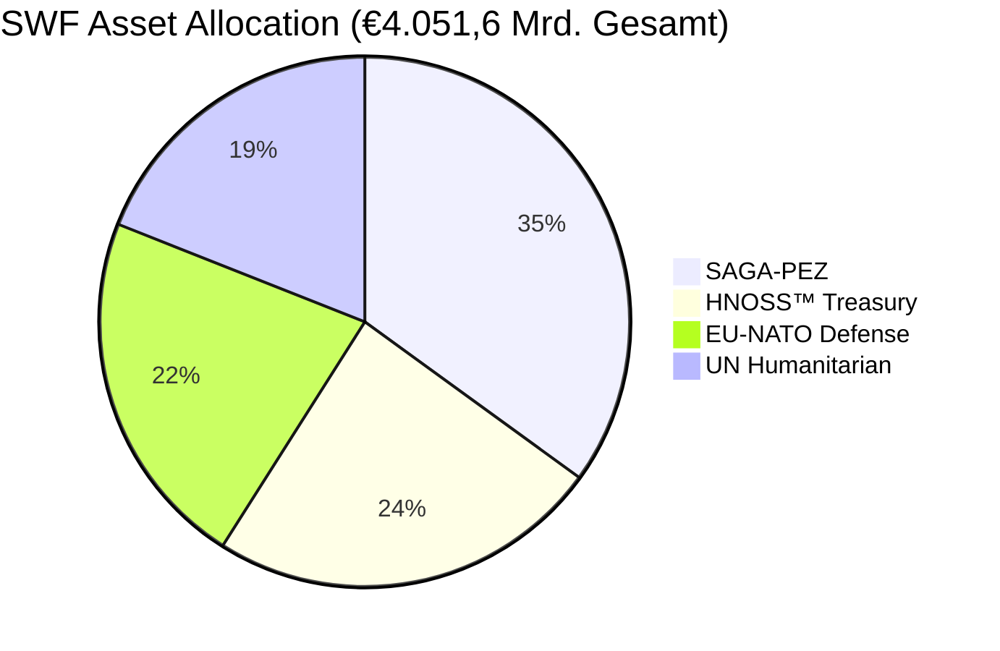
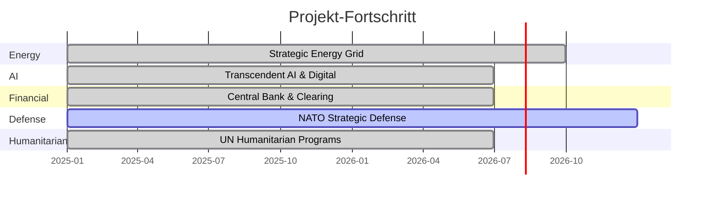
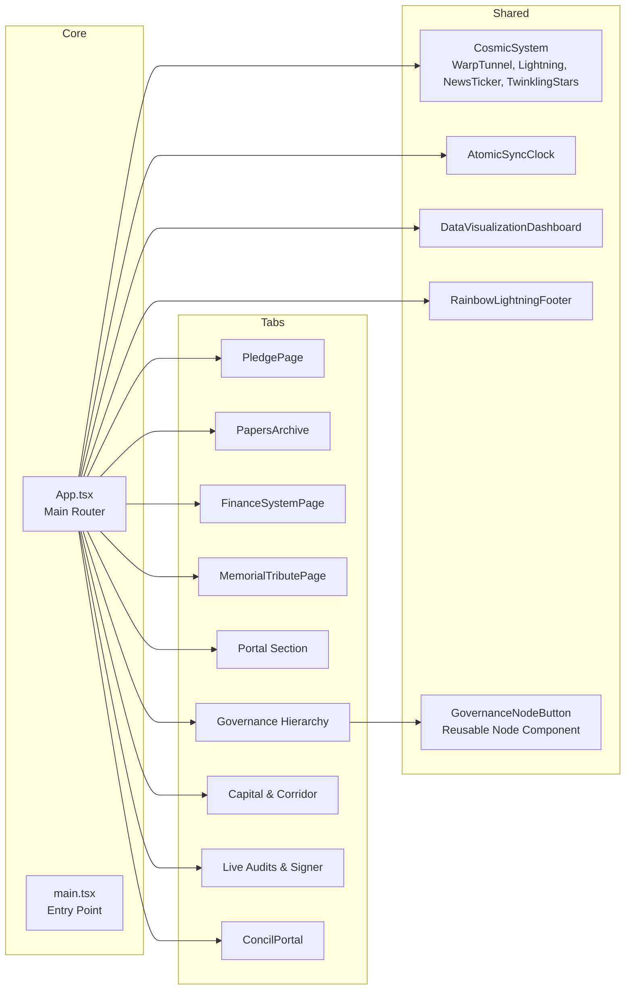

# 🌟 **STARLIGHTMOVEMENTS** — Official Corporation Portal

<p align="center">
  
  
  
  
</p>

> **📸 Snapshot:** `ArchYTecTIaLObItZFaCe` — Vollständiger Projektstand nach Deep Scan & Reconstructive Debugging  
> **🔖 Tag:** `git checkout ArchYTecTIaLObItZFaCe`  
> **🌐 Live:** `http://localhost:3000/` *(Vite Dev Server)*

---

## 📋 **EXECUTIVE SUMMARY** — *Komplette Projektübersicht*

```
╔══════════════════════════════════════════════════════════════════════╗
║                   STARLIGHTMOVEMENTS OFFICIAL PORTAL               ║
║        Humanitarian · Political · Spiritual · Defense              ║
║                                                                     ║
║   Ein globales Bündnis für menschliche Souveränität und             ║
║   Regeneration — basierend auf PNIA, Genesis-Protokoll und         ║
║   dem System der Zweiten Chance als Daseinsvorsorge.               ║
╚══════════════════════════════════════════════════════════════════════╝
```

### 🔷 **Projekt-Kern**

| Dimension | Beschreibung |
|-----------|-------------|
| **🇪🇺 EU-UNION** | Regulatory Governance Layer — eID-Brücken (Freja eID / Schweden ID) |
| **🛡️ NATO** | Strategic Defense Model — Operational Defense Structure |
| **🏛️ Pentagon** | Strategic Planning & Defense Blueprint |
| **🌍 United Nations** | Global Coordination Layer & UNGM Node |
| **💠 HNOSS** | PrisMaTHarIOn — Global Reference Governance System |

### 📊 **Tabellen: Projekt-Kennzahlen**

| Metrik | Wert |
|--------|------|
| **Gesamt-Sovereign-Kapital** | € 4.051,6 Mrd. (CNP System) |
| **SWF Asset Pools** | 4 (SAGA-PEZ, HNOSS™, EU-NATO-DP, UNGM-PIC) |
| **Projekt-Korridore** | 5 (Energy, AI, Financial, Defense, Humanitarian) |
| **Governance-Ebenen** | 6 Level (TX → TXA → GOV/FI/SWFs → HUB → Projects → Framework) |
| **Registry IDs** | D-U-N-S, VAT, UNGM, LEI, Swiss ID |
| **Navigation-Tabs** | 9 (Pledge, Papers, Finance, Memorial, Portal, Governance, Capital, Audit, Concil) |

---

## 🏗️ **ARCHITEKTUR-DIAGRAMM** — *Governance & Marktstruktur*



---

## 🗺️ **INTERAKTIVE FUNKTIONS-LANDKARTE**

### 🔹 **1. Government Pledge Page** — *Das Globale Bündnis*
- 📜 10 Institutionen (NATO, VA, OCC, SCOTUS, UN OLA, UN Treaties, PFPA, USUN, U.S. House, Europol)
- ✉️ Interaktives Submission-Formular mit automatischer Betreff-Anpassung
- 📋 Copy-to-Clipboard für Cover Letters
- 🏛️ Pledge-Vertragstext (Präambel, Artikel I-VI, Schlussbestimmungen)

### 🔹 **2. Papers Archive** — *Wissenschaftliche Dokumentation*
- 📚 8 Analyse-Dokumente aus dem `analysis/` Ordner
- 🔍 Overlay-Viewer für Markdown-Dokumente
- 🏷️ Kategorisiert nach Thema

### 🔹 **3. Finance System** — *Finanzsystem-Architektur*
- 💰 SWF Asset Pools mit Allokations-Balken
- 📊 Graphische Aufteilung der Sovereign Wealth Funds
- 📈 Projekt-Korridore mit Fortschrittsbalken
- 🏦 SAGA-PEZ Partner-Framework

### 🔹 **4. Memorial Tribute** — *Gedenkstätte*
- 🕊️ Tribute-Ansicht mit persönlicher Widmung
- 👤 Verstorbene Key-Personen aus 20+ Ländern
- ⚰️ Friedhofs- und Team-Informationen

### 🔹 **5. Identity Portal** — *100% Original Identity Design*
- ⭐ 8 Orbit Stars (s1-s8)
- 🔷 Hexagon-Frame mit 6 Hex-Stars
- 🌟 Metallic-Gold/Silver Text Effekte
- 🌈 Rainbow-Glow Animationen
- 🔐 Secure Terminal Access mit E-Mail/Telefon
- 🔗 SAGA-PEZ Verification Info Hub (6 Nodes)
- 📜 Heavenly Chronicles Timeline

### 🔹 **6. Governance Hierarchy** — *Institutionelle Governance-Architektur*
- 🎯 6 Ebenen interaktive Nodes (TX → TXA → GOV/FI/SWFs → HUB → Projects → Framework)
- ✨ Cosmic Pulse Ring & Shimmer Effekte bei Hover
- 📋 Detail-Panel mit Mandat, Politik, Wissenschaft, Spiritual, Krypto-Modulen
- 📜 ASCII Spec Blueprint-Ansicht
- 📊 DataVisualizationDashboard (Recharts)

### 🔹 **7. Capital & Corridor Map** — *Finanzmarkt- & Infrastrukturdaten*
- 💼 SWF_ASSETS: SAGA-PEZ (35%), HNOSS™ (24%), EU-NATO-DP (22%), UNGM-PIC (19%)
- 🚀 PROJECT_CORRIDORS: Energy (€950B), AI (€1.200B), Financial (€780B), Defense (€1.100B), Humanitarian (€650B)

### 🔹 **8. Live Audits & Signer** — *Kryptographischer Transaktions-Signierer*
- ✍️ Digital Signing Form mit Quellen/Zielen/Beträgen
- 🔗 Echtzeit-Blockchain-Ledger-Stream
- 🟢 TSAI Audit Status: GREEN
- ⚡ Live Ticker (4 Sekunden Intervall)

### 🔹 **9. Concil Portal** — *Official Documentation Archive*
- 📑 Concil-Protokolle (CP01)
- 📄 Vollständige PNIA-Dokumentation
- 🏛️ Staatliche Strukturen

---

## 💠 **SWF ASSET ALLOCATION** — *Sovereign Wealth Funds*



| Asset | Code | Kapital | Anteil | LPs | GPs |
|-------|------|---------|--------|-----|-----|
| SAGA-PEZ Sovereign Capital | SAGA-PEZ | €1.420,5 Mrd. | 35% | EpsLGSEz | PgEz |
| Hnoss Treasury Reserve | HNOSS™ | €980,2 Mrd. | 24% | Daniel Pohl (HolyThreeKings) | GLp |
| EU-NATO Defense Capital | EU-NATO-DP | €890,1 Mrd. | 22% | Pentagon Structure | pg_slz |
| United Nations Humanitarian | UNGM-PIC | €760,8 Mrd. | 19% | UN Global Coordination | EpsLGSEz |

---

## 🚀 **PROJEKT-KORRIDORE** — *Infrastruktur-Entwicklung*



| Projekt | Kategorie | Budget | Fortschritt | Nodes | Architekt |
|---------|-----------|--------|-------------|-------|-----------|
| Strategic Energy Grid | Energy | €950 Mrd. | ████████░░ 88% | 140 | HNOSS Architecture Core |
| Transcendent AI & Digital | AI | €1.200 Mrd. | █████████░ 94% | 280 | Daniel Pohl / H31mBL42ur |
| Central Bank & Clearing | Financial | €780 Mrd. | █████████░ 91% | 95 | D-U-N-S Certified Partners |
| NATO Strategic Defense | Defense | €1.100 Mrd. | ████████░░ 85% | 165 | Pentagon Joint Coordination |
| UN Humanitarian Programs | Humanitarian | €650 Mrd. | █████████▉ 97% | 210 | HolyThreeKings Charitable Trust |

---

## 🧩 **KOMPONENTEN-STRUKTUR** — *React Component Tree*



---

## 🛡️ **SECURITY LAYER** — *Autonome Schutzmechanismen*

```
┌─────────────────────────────────────────────────────────────────┐
│                  HNOSS AUTONOMOUS SECURITY                      │
├─────────────────────────────────────────────────────────────────┤
│  • Hardware-Token: Browser-Fingerprint (UserAgent, Screen,     │
│    HardwareConcurrency, Plugins) → sessionStorage              │
│  • Anti-Forensics: Autocomplete/Spellcheck deaktiviert         │
│  • MutationObserver: Blockiert unautorisierte Script-Injection │
│  • CSP: default-src 'self'; style-src fonts.googleapis.com;    │
│    font-src fonts.gstatic.com; img-src 'self' data:;           │
└─────────────────────────────────────────────────────────────────┘
```

---

## 🔐 **REGISTRY & ZERTIFIZIERUNGEN**

| Registrierung | ID |
|---------------|-----|
| **D-U-N-S Registry** | `315676980` \| `317066336` |
| **VAT ID & EU-Ref** | `DE441892129` \| `EX2025D1218310` |
| **UNGM & PIC** | `1172700` \| `873042778` |
| **Global LEI System** | `894500GBJSIW8L6ET310` |
| **Swiss National ID** | `756.6199.0539.28` |

---

## 🛠️ **TECH-STACK**

| Technologie | Version | Zweck |
|-------------|---------|-------|
| **Vite** | 6.4.3 | Build-Tool & Dev-Server |
| **React** | 19.0.1 | UI Framework |
| **TypeScript** | 5.8.2 | Type Safety |
| **Tailwind CSS** | 4.1.14 | Utility-First CSS |
| **Motion (Framer Motion)** | 12.23.24 | Animationen |
| **Lucide React** | 0.546.0 | Icons |
| **Recharts** | 3.8.1 | Diagramme |
| **ESLint** | 9.x | Code Quality (0 Errors ✅) |
| **@tailwindcss/vite** | 4.1.14 | Tailwind v4 Vite Plugin |

---

## 📂 **PROJEKTSTRUKTUR** — *Dateibaum*

```
src/
├── App.tsx                          # Haupt-Router (9 Tabs)
├── main.tsx                         # Entry Point
├── index.css                        # Global Styles + Tailwind
├── data.ts                          # Daten (Nodes, Assets, Corridors, Audits)
├── types.ts                         # TypeScript Interfaces
├── autonomous-security.ts           # Security Layer
└── components/
    ├── AtomicSyncClock.tsx          # Atomuhr-Komponente
    ├── ConcilPortal.tsx             # Concil Dokumentation
    ├── CosmicSystem.tsx             # WarpTunnel, Lightning, NewsTicker, Stars
    ├── DataVisualizationDashboard.tsx # Recharts Dashboard
    ├── FinanceSystemPage.tsx        # Finanzsystem
    ├── GovernanceNodeButton.tsx     # Wiederverwendbarer Node-Button
    ├── MemorialTributePage.tsx      # Gedenkstätte
    ├── PapersArchive.tsx            # Dokumenten-Archiv
    ├── PledgePage.tsx               # Government Pledge
    ├── RainbowLightningFooter.tsx   # Footer mit Memorial + Crystal
    └── ToolchainMap.tsx             # Toolchain-Übersicht
```

---

## 🚀 **QUICKSTART**

```bash
# 1. Snapshot wiederherstellen (Backup-Punkt)
git checkout ArchYTecTIaLObItZFaCe

# 2. Entwicklungsserver starten
npm run dev
# → http://localhost:3000/

# 3. Build für Produktion
npm run build

# 4. ESLint prüfen
npm run lint
# → ✅ 0 Errors
```

---

---

## 📜 **PROPRIETARY LICENSE — ALL RIGHTS RESERVED**

```
╔══════════════════════════════════════════════════════════════════════╗
║              HCOS - HNOSS CONTROL OPERATING SYSTEM                 ║
║                PROPRIETARY LICENSE - ALL RIGHTS RESERVED            ║
╚══════════════════════════════════════════════════════════════════════╝
```

**COPYRIGHT NOTICE:**  
Copyright © 2024-2026 Daniel Pohl. All Rights Reserved Worldwide.

**OWNERSHIP & PROPRIETARY RIGHTS:**  
This software, including but not limited to source code, object code, documentation, algorithms, architecture designs, and all associated intellectual property (collectively "The Work") is the exclusive property of Daniel Pohl and the following authorized corporate entities:

- **HNOSS Enterprises**
- **PRISMANTHARION Corporation**
- **SHINEHEALTHCARE GmbH**
- **STARLIGHTMOVEMENTS AG**

**NO RIGHTS TRANSFERRED:**  
NO RIGHTS ARE GRANTED, TRANSFERRED, OR ASSIGNED BY THE PUBLICATION, AVAILABILITY, OR EXISTENCE OF THIS CODE. The presence of this code in any repository does NOT constitute an offer of license, partnership, or authorization for use by any third party.

**RESTRICTIONS:**  
1. NO USE — No person or entity may use, execute, run, or operate this code  
2. NO COPY — No copying, reproduction, or duplication is permitted  
3. NO MODIFICATION — No derivative works or modifications allowed  
4. NO DISTRIBUTION — No redistribution, sharing, or publication permitted  
5. NO CLONING — Repository cloning by unauthorized parties is prohibited  
6. NO REVERSE ENGINEERING — Decompilation, disassembly strictly forbidden

**LEGAL STATUS:**  
This is a **PILOT PROJECT** developed in collaboration with:
- European Union Institutions
- NATO (North Atlantic Treaty Organization)
- The Pentagon / United States Department of Defense
- United Nations (UN)
- Deutsche Börse AG
- And additional classified governmental and institutional partners

**INTELLECTUAL PROPERTY PROTECTION:**  
This Work is protected by International Copyright Law (Berne Convention), European Union Copyright Directives, United States Copyright Act of 1976, German Copyright Law (Urheberrechtsgesetz), Patent Law (where applicable), Trade Secret Law, and Contract Law.

**VIOLATIONS & ENFORCEMENT:**  
Any unauthorized access, use, copying, cloning, or distribution constitutes Copyright Infringement, Trade Secret Misappropriation, Computer Fraud and Abuse (18 U.S.C. § 1030), Economic Espionage (18 U.S.C. § 1831), and Criminal Offense under applicable international treaties. Violators will be prosecuted to the maximum extent of the law, including Civil damages, Criminal prosecution, Referral to INTERPOL, and Inclusion in government security watchlists.

**CONTACT & AUTHORIZATION INQUIRIES:**  
For licensing inquiries or authorized use permissions: Contact Legal Department — HNOSS Enterprises  
*Status: CLASSIFIED — PILOT PROJECT — NOT FOR PUBLIC DISTRIBUTION*

```
BY ACCESSING THIS CODE, YOU ACKNOWLEDGE THAT YOU HAVE NO RIGHTS TO USE,
COPY, MODIFY, DISTRIBUTE, OR EXPLOIT THIS WORK IN ANY MANNER.
```

**Effective Date:** January 1, 2024 — **Last Modified:** May 9, 2026 — **Version:** PILOT-2026-EU-NATO-CLASSIFIED

---

## 🎗️ **GIVING 4TH — PLEDGE & INITIATIVE**

**Pledge to “Give 4th” on July 4th**  

Unser 'Giving 4th'-Pledge ist eine bewusste Erweiterung der Feierlichkeiten zum Unabhängigkeitstag. Wir verpflichten uns dazu, diesen Tag als Anlass für aktives gesellschaftliches Engagement zu nutzen, indem wir Gemeinschaften und Anliegen unterstützen, die für uns von zentraler Bedeutung sind.

- 📌 **Pledge Projekt:** [LinkedIn Pledge Projekt](https://lnkd.in/eKsmMqz3)  
- 📌 **Offizieller Pledge:** [https://lnkd.in/e2rHUgd2](https://lnkd.in/e2rHUgd2)  
- 📌 **Partner Initiative:** [https://lnkd.in/e4jZ3uuw](https://lnkd.in/e4jZ3uuw)  
- 📌 **America250:** [https://america250.org/](https://america250.org/) & [LinkedIn](https://lnkd.in/eCZuhXUE)  
- 📌 **USA.gov:** [https://www.usa.gov/](https://www.usa.gov/)  

*Giving 4th calls on all Americans to add something new to their July 4th celebrations: giving back to the causes and communities they care about.*

---

## 🌐 **THE GIVES TO: GLOBALE STAKEHOLDER & ÜBERMITTLUNGSKANÄLE**

Offizielle Kontaktstellen für den Pledge am 4. Juli 2026. Jeder Eintrag ist eine direkte Andock-Schnittstelle zwischen der Genesis-Protokoll-Architektur und den jeweiligen Institutionen.

| Institution | Kategorie | URL |
|-------------|-----------|-----|
| **NATO** | Strategic Defense Model | [www.nato.int](https://www.nato.int) |
| **U.S. Dept. of Veterans Affairs** | Veterans Welfare & Reintegration | [department.va.gov](https://department.va.gov) |
| **OCC Secure Portal** | Office of the Comptroller of the Currency | [occ.secureocp.com](https://occ.secureocp.com) |
| **Supreme Court of the U.S.** | Judicial Authority — Smart Justice | [www.supremecourt.gov](https://www.supremecourt.gov) |
| **United Nations — OLA** | Global Coordination Layer | [www.un.org](https://www.un.org) |
| **UN Treaty Collection** | Multilateral Treaty Registry | [treaties.un.org](https://treaties.un.org) |
| **Pentagon Force Protection Agency** | Operational Defense Structure | [www.pfpa.mil](https://www.pfpa.mil) |
| **U.S. Mission to the UN** | Diplomatic Access Channel | [usun.usmission.gov](https://usun.usmission.gov) |
| **U.S. House of Representatives** | Technology Services Submission | [www.house.gov](https://www.house.gov) |
| **Europol** | EU Law Enforcement | [www.europol.europa.eu](https://www.europol.europa.eu) |
| **Freedom of Information Act** | FOIA | [www.foia.gov](https://www.foia.gov) |
| **Ledger Wallet™** | Digital Assets | [Ledger Link](https://lnkd.in/enMi-UzM) |

---

## 🔗 **APPENDIX: VALIDATED OFFICIAL URLs & ANCHORS**

### 1. Eigene & Autorisierte Corporate Entities
| Entity | URL |
|--------|-----|
| STARLIGHTMOVEMENTS AG / StarLightMovemenTz Foundation | [GitHub Repository](https://github.com/WorldWide-Since-2026-We-Trusted-Since/sTarLighTsMoveMenTs---Official-Corporation-from-EU-UNION-NATO-Pentagon-UN.git) |
| HNOSS Enterprises | *(wie oben)* |
| PRISMANTHARION Corporation | *(wie oben)* |
| SHINEHEALTHCARE GmbH | *(wie oben)* |

### 2. Externe Partner-Unternehmen & Finanzdienstleister
| Unternehmen | URL |
|-------------|-----|
| Deutsche Börse AG | [https://www.deutsche-boerse.com](https://www.deutsche-boerse.com) |
| Ledger Wallet™ | [https://www.ledger.com](https://www.ledger.com) |
| Plaid | [https://plaid.com](https://plaid.com) |

### 3. Internationale Behörden & Organisationen
| Organisation | URL |
|-------------|-----|
| Europäische Kommission | [https://commission.europa.eu](https://commission.europa.eu) |
| Council of the European Union | [https://www.consilium.europa.eu](https://www.consilium.europa.eu) |
| Europol | [https://www.europol.europa.eu](https://www.europol.europa.eu) |
| INTERPOL | [https://www.interpol.int](https://www.interpol.int) |
| NATO | [https://www.nato.int](https://www.nato.int) |
| United Nations (UN) | [https://www.un.org](https://www.un.org) |
| UN Treaty Collection | [https://treaties.un.org](https://treaties.un.org) |

### 4. US-Institutionen, Justiz & Zivilgesellschaft
| Institution | URL |
|-------------|-----|
| The Pentagon / U.S. DoD | [https://www.defense.gov](https://www.defense.gov) |
| Pentagon Force Protection Agency (PFPA) | [https://www.pfpa.mil](https://www.pfpa.mil) |
| Supreme Court of the United States | [https://www.supremecourt.gov](https://www.supremecourt.gov) |
| U.S. Department of Veterans Affairs | [https://www.va.gov](https://www.va.gov) / [department.va.gov](https://department.va.gov) |
| Office of the Comptroller of the Currency (OCC) | [https://www.occ.treas.gov](https://www.occ.treas.gov) / [occ.secureocp.com](https://occ.secureocp.com) |
| U.S. House of Representatives | [https://www.house.gov](https://www.house.gov) |
| Freedom of Information Act (FOIA) | [https://www.foia.gov](https://www.foia.gov) |
| America250 / Freedom 250 | [https://america250.org](https://america250.org) |

### 5. Deutsche Bundesbehörden & Justiz
| Behörde | URL |
|---------|-----|
| Deutscher Bundestag | [https://www.bundestag.de](https://www.bundestag.de) |
| Bundesamt für Verfassungsschutz (BfV) | [https://www.verfassungsschutz.de](https://www.verfassungsschutz.de) |
| BaFin | [https://www.bafin.de](https://www.bafin.de) |
| Physikalisch-Technische Bundesanstalt (PTB) | [https://www.ptb.de](https://www.ptb.de) |

---

## 🏛️ **OFFICIAL SIGNATORIES & PARTNERS**

**Big GreeTings from:**
- European Commission Council of the European Union
- Deutscher Bundestag — Verwaltung
- Bundesamt für Verfassungsschutz (BfV)
- INTERPOL
- Deutsche Börse Group
- BaFin
- Europol
- Pentagon Force Protection Agency
- Supreme Court of the U.S.
- NATO — The North Atlantic Treaty Organization
- United Nations
- Freedom 250

**Authorized Executive Signatory:**

**A.d.L. ST. Daniel Pohl**  
*EU-UNION Expert (ID: EX2025D1218310)*  
*Detmold, Germany*

---

<p align="center">
  <strong>⚡ sTarLighTsMoveMenTs ⚡</strong><br/>
  <em>Freiheit · Frieden · Vergebung · Nächstenliebe · Hoffnung über alle Welten</em><br/><br/>
  <br/><br/>
  <sub>PROPRIETARY LICENSE — ALL RIGHTS RESERVED — PILOT-2026-EU-NATO-CLASSIFIED</sub>
</p>
