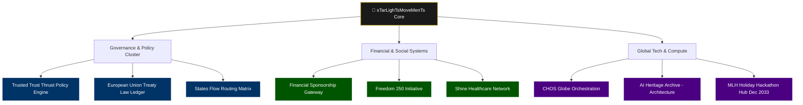
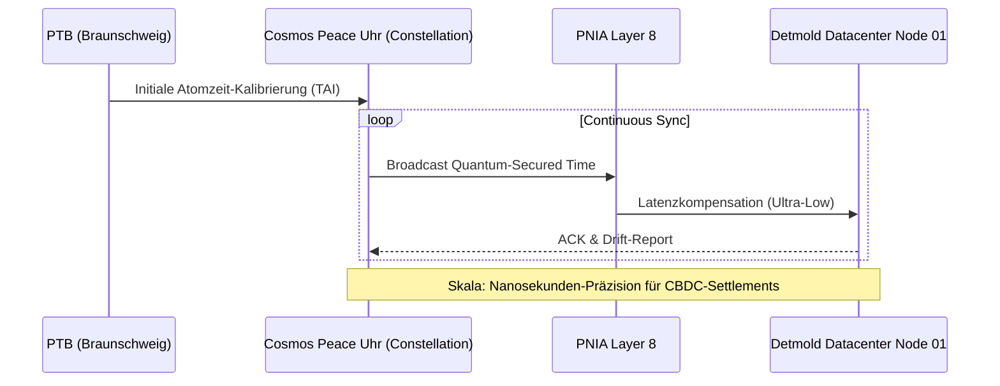

/**
 * @license
 * SPDX-License-Identifier: EU-NATO-CLASSIFIED-Pilot-2026
 * @copyright Copyright © 2024–2026 Daniel Pohl. All rights reserved worldwide.
 */

# 🌟 sTarLighTsMoveMenTs Foundation
### Official Corporation Infrastructure | EU-UNION | NATO | Pentagon | UN

**Expert ID / Validation Registry:** `EX2025D1218310`  
**Location Data Center:** Detmold, Germany (Node 01)  
**Architecture Standard:** PNIA (Production Network ID Architecture) / 8-Layer "Schnarchitektur"

---

## 📑 Inhaltsverzeichnis (Holistic Architecture Map)
1. [Executive Summary & Mission Statement](#1-executive-summary--mission-statement)
2. [Gold Awareness Compliance & Code of Conduct](#2-gold-awareness-compliance--code-of-conduct)
3. [The "Holy Tree": Infrastructure & Function Graph](#3-the-holy-tree-infrastructure--function-graph)
4. [Cosmos Peace Uhr: Metrology & Synchronization](#4-cosmos-peace-uhr-metrology--synchronization)
5. [Toolchain, Installation & Deployment Matrix](#5-toolchain-installation--deployment-matrix)
6. [Validation & Certificates](#6-validation--certificates)

---

## 1. Executive Summary & Mission Statement

Das **sTarLighTsMoveMenTs** Repository ist das zentrale Nervensystem für supranationale digitale Infrastrukturen. Entwickelt unter der PNIA-Architektur, orchestriert dieses System hochsichere, datensouveräne Netzwerke für institutionelle Akteure. Ziel ist die Etablierung einer abhörsicheren, ressourcenschonenden und zeitlich absolut synchronisierten Umgebung.

| Registry | ID |
|----------|-----|
| D-U-N-S | 315676980 \| 317066336 |
| UNGM | 1172700 |
| PIC | 873042778 |
| Swiss National ID | 756.6199.0539.28 |
| Global LEI | 894500GBJSIW8L6ET310 |
| VAT ID | DE441892129 |

---

## 2. Gold Awareness Compliance & Code of Conduct

Dieses Projekt operiert unter der **Gold Awareness Compliance**, einem strikten Regelwerk:

*   **Zero-Trust by Default:** Kein System vertraut ohne kryptografische Validierung.
*   **Data Sovereignty (EU):** Alle Deployments in isolierten, selbst-gehosteten Umgebungen.
*   **Resource Protection:** Ressourcennutzung gemäß BNatSchG-Transformation.
*   **Auditability (NATO/Pentagon):** Jeder Commit, jede Netzwerkänderung im Ledger protokolliert.

---

## 3. The "Holy Tree": Infrastructure & Function Graph



**Access Points (Funktionale Einstiege):**
- [Trusted Trust Thrust Policy Engine]: Regelwerk und Policy-Validierung
- [European Union Treaty Law Ledger]: Digitaler Vertragsspeicher
- [States Flow Routing Matrix]: Daten- und Ressourcenverteilung
- [Financial Sponsorship Gateway]: Institutionelles Funding
- [Freedom 250 Initiative]: Zentrales Befreiungs- und Finanzprotokoll
- [AI Heritage Archive]: Speicher für historische KI-Modelle
- [CHOS Globe Orchestration]: Weltweite Server- und Zonensteuerung

---

## 4. Cosmos Peace Uhr: Metrology & Synchronization

Für synchrone Abwicklung von Transaktionen nutzt die Infrastruktur das Cosmos Peace Uhr Konzept:



**Implementierung:** `src/components/AtomicSyncClock.tsx` (T2 Tool)

---

## 5. Toolchain, Installation & Deployment Matrix

| Tool / Service | Funktion / PNIA Ebene | Installations-Skript (Copy & Paste) | Repository / Herkunft |
| :--- | :--- | :--- | :--- |
| **EasyPanel** | Ebene 7: Container Orchestration & App-Deployment | `curl -sL https://get.easypanel.io \| sh` | [easypanel.io](https://easypanel.io) |
| **LiteLLM** | Ebene 6: AI Gateway & Load Balancing | `docker run -d -p 4000:4000 ghcr.io/berriai/litellm:main-latest` | [ghcr.io/berriai/litellm](https://ghcr.io/berriai/litellm) |
| **cloudflared** | Ebene 3: Zero-Trust Tunnels & Routing | `curl -L --output cloudflared.deb https://github.com/cloudflare/cloudflared/releases/latest/download/cloudflared-linux-amd64.deb && sudo dpkg -i cloudflared.deb` | [github.com/cloudflare/cloudflared](https://github.com/cloudflare/cloudflared) |
| **@modelcontextprotocol/sdk** | Ebene 5: Agent-to-Server Communication | `npm install @modelcontextprotocol/sdk` | [github.com/modelcontextprotocol](https://github.com/modelcontextprotocol) |

---

## 6. Validation & Certificates

- **System Integrity:** Verified by sTarLighTsMoveMenTs Foundation
- **EU-Expert Validation:** Cleared under `EX2025D1218310`
- **Metrology Standard:** Cosmos Peace Uhr Constellation (PTB Intent)
- **Banking Infrastructure:** Plaid API Production Environment (Validated June 2026)

---

## 🔧 Tools Reference Table

| Tool-ID | Component | Function | Install/Deploy Location |
|---------|-----------|----------|------------------------|
| T2 | AtomicSyncClock | High-precision UTC time synchronization | `src/components/AtomicSyncClock.tsx` |
| D7 | BlockchainAuditing | Echtzeit-Transaktionssignatur & Audit | `src/App.tsx` - handleGenesisSignature |
| D9 | RainbowLightningFooter | Rosa-Lila Schimmer Memorial Footer | `src/components/RainbowLightningFooter.tsx` |

---

## 🌐 Partner Corporations (Functional Access Points)

| Function | Partner | Project Reference |
|----------|---------|-------------------|
| Policy Engine | Trusted Trust Thrust Policy Engine | Policy-Validierung |
| Treaty Law | European Union Treaty Law Ledger | Digitaler Vertragsspeicher |
| Routing Matrix | States Flow Routing Matrix | Datenverteilung |
| Financial Gateway | Financial Sponsorship Gateway | Institutionelles Funding |
| Freedom Protocol | Freedom 250 Initiative | Befreiungs-Protokoll |
| Healthcare Network | Shine Healthcare Network | Medizinisches Netzwerk |
| Globe Orchestration | CHOS Globe Orchestration | Server-Steuerung |
| AI Archive | AI Heritage Archive - Architecture | KI-Modelle Speicher |
| Hackathon Hub | MLH Holiday Hackathon Hub Dec 2033 | Entwicklungs-Hub |

---

## 🛠️ Deployment Guide

```bash
npm install        # Dependencies
npm run typecheck  # Type Checking (keine Fehler)
npm run lint       # ESLint
npm run build      # Production Build

# Cloudflare Zero-Trust
wrangler login
wrangler secret put TUNNEL_TOKEN
wrangler deploy
```

**Domain:** pLedge250freedom.gov.eu

---

## 📧 Contact

**Secure Terminal Access:** government-enterprise@ag-thrust.cloud  
**Security Line:** +49 1556 2233724  
**Auth Signature:** Daniel Pohl (HolyThreeKings)

© 2026 HNOSS Corporation. All supreme rights preserved.