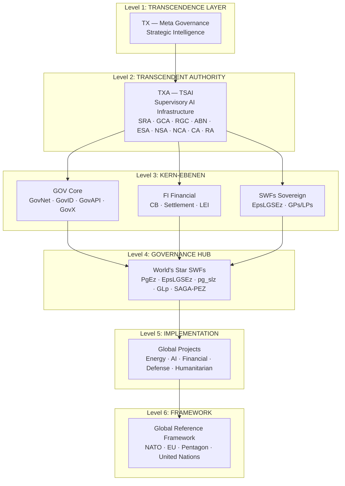
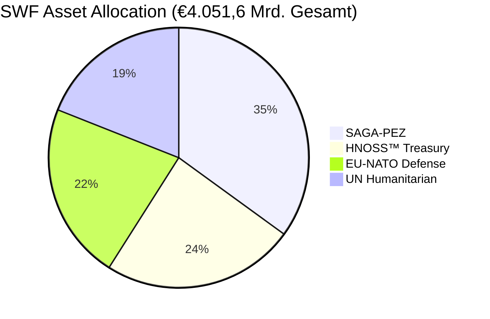
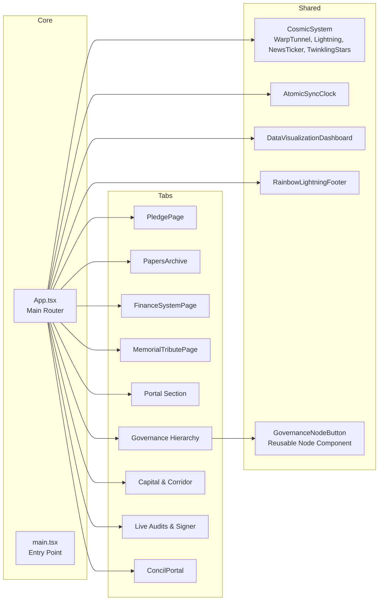

# 🌟 **STARLIGHTMOVEMENTS** — Official Corporation Portal

<p align="center">
  
  
  
  
</p>

> **📸 Snapshot:** `ArchYTecTIaLObItZFaCe` — Vollständiger Projektstand nach Deep Scan & Reconstructive Debugging  
> **🔖 Tag:** `git checkout ArchYTecTIaLObItZFaCe`  
> **🌐 Live:** `http://localhost:3000/` *(Vite Dev Server)*

---

## 📋 **EXECUTIVE SUMMARY** — *Komplette Projektübersicht*

```
╔══════════════════════════════════════════════════════════════════════╗
║                   STARLIGHTMOVEMENTS OFFICIAL PORTAL               ║
║        Humanitarian · Political · Spiritual · Defense              ║
║                                                                     ║
║   Ein globales Bündnis für menschliche Souveränität und             ║
║   Regeneration — basierend auf PNIA, Genesis-Protokoll und         ║
║   dem System der Zweiten Chance als Daseinsvorsorge.               ║
╚══════════════════════════════════════════════════════════════════════╝
```

### 🔷 **Projekt-Kern**

| Dimension | Beschreibung |
|-----------|-------------|
| **🇪🇺 EU-UNION** | Regulatory Governance Layer — eID-Brücken (Freja eID / Schweden ID) |
| **🛡️ NATO** | Strategic Defense Model — Operational Defense Structure |
| **🏛️ Pentagon** | Strategic Planning & Defense Blueprint |
| **🌍 United Nations** | Global Coordination Layer & UNGM Node |
| **💠 HNOSS** | PrisMaTHarIOn — Global Reference Governance System |

### 📊 **Tabellen: Projekt-Kennzahlen**

| Metrik | Wert |
|--------|------|
| **Gesamt-Sovereign-Kapital** | € 4.051,6 Mrd. (CNP System) |
| **SWF Asset Pools** | 4 (SAGA-PEZ, HNOSS™, EU-NATO-DP, UNGM-PIC) |
| **Projekt-Korridore** | 5 (Energy, AI, Financial, Defense, Humanitarian) |
| **Governance-Ebenen** | 6 Level (TX → TXA → GOV/FI/SWFs → HUB → Projects → Framework) |
| **Registry IDs** | D-U-N-S, VAT, UNGM, LEI, Swiss ID |
| **Navigation-Tabs** | 9 (Pledge, Papers, Finance, Memorial, Portal, Governance, Capital, Audit, Concil) |

---

## 🏗️ **ARCHITEKTUR-DIAGRAMM** — *Governance & Marktstruktur*



---

## 🗺️ **INTERAKTIVE FUNKTIONS-LANDKARTE**

### 🔹 **1. Government Pledge Page** — *Das Globale Bündnis*
- 📜 10 Institutionen (NATO, VA, OCC, SCOTUS, UN OLA, UN Treaties, PFPA, USUN, U.S. House, Europol)
- ✉️ Interaktives Submission-Formular mit automatischer Betreff-Anpassung
- 📋 Copy-to-Clipboard für Cover Letters
- 🏛️ Pledge-Vertragstext (Präambel, Artikel I-VI, Schlussbestimmungen)

### 🔹 **2. Papers Archive** — *Wissenschaftliche Dokumentation*
- 📚 8 Analyse-Dokumente aus dem `analysis/` Ordner
- 🔍 Overlay-Viewer für Markdown-Dokumente
- 🏷️ Kategorisiert nach Thema

### 🔹 **3. Finance System** — *Finanzsystem-Architektur*
- 💰 SWF Asset Pools mit Allokations-Balken
- 📊 Graphische Aufteilung der Sovereign Wealth Funds
- 📈 Projekt-Korridore mit Fortschrittsbalken
- 🏦 SAGA-PEZ Partner-Framework

### 🔹 **4. Memorial Tribute** — *Gedenkstätte*
- 🕊️ Tribute-Ansicht mit persönlicher Widmung
- 👤 Verstorbene Key-Personen aus 20+ Ländern
- ⚰️ Friedhofs- und Team-Informationen

### 🔹 **5. Identity Portal** — *100% Original Identity Design*
- ⭐ 8 Orbit Stars (s1-s8)
- 🔷 Hexagon-Frame mit 6 Hex-Stars
- 🌟 Metallic-Gold/Silver Text Effekte
- 🌈 Rainbow-Glow Animationen
- 🔐 Secure Terminal Access mit E-Mail/Telefon
- 🔗 SAGA-PEZ Verification Info Hub (6 Nodes)
- 📜 Heavenly Chronicles Timeline

### 🔹 **6. Governance Hierarchy** — *Institutionelle Governance-Architektur*
- 🎯 6 Ebenen interaktive Nodes (TX → TXA → GOV/FI/SWFs → HUB → Projects → Framework)
- ✨ Cosmic Pulse Ring & Shimmer Effekte bei Hover
- 📋 Detail-Panel mit Mandat, Politik, Wissenschaft, Spiritual, Krypto-Modulen
- 📜 ASCII Spec Blueprint-Ansicht
- 📊 DataVisualizationDashboard (Recharts)

### 🔹 **7. Capital & Corridor Map** — *Finanzmarkt- & Infrastrukturdaten*
- 💼 SWF_ASSETS: SAGA-PEZ (35%), HNOSS™ (24%), EU-NATO-DP (22%), UNGM-PIC (19%)
- 🚀 PROJECT_CORRIDORS: Energy (€950B), AI (€1.200B), Financial (€780B), Defense (€1.100B), Humanitarian (€650B)

### 🔹 **8. Live Audits & Signer** — *Kryptographischer Transaktions-Signierer*
- ✍️ Digital Signing Form mit Quellen/Zielen/Beträgen
- 🔗 Echtzeit-Blockchain-Ledger-Stream
- 🟢 TSAI Audit Status: GREEN
- ⚡ Live Ticker (4 Sekunden Intervall)

### 🔹 **9. Concil Portal** — *Official Documentation Archive*
- 📑 Concil-Protokolle (CP01)
- 📄 Vollständige PNIA-Dokumentation
- 🏛️ Staatliche Strukturen

---

## 💠 **SWF ASSET ALLOCATION** — *Sovereign Wealth Funds*



| Asset | Code | Kapital | Anteil | LPs | GPs |
|-------|------|---------|--------|-----|-----|
| SAGA-PEZ Sovereign Capital | SAGA-PEZ | €1.420,5 Mrd. | 35% | EpsLGSEz | PgEz |
| Hnoss Treasury Reserve | HNOSS™ | €980,2 Mrd. | 24% | Daniel Pohl (HolyThreeKings) | GLp |
| EU-NATO Defense Capital | EU-NATO-DP | €890,1 Mrd. | 22% | Pentagon Structure | pg_slz |
| United Nations Humanitarian | UNGM-PIC | €760,8 Mrd. | 19% | UN Global Coordination | EpsLGSEz |

---

## 🚀 **PROJEKT-KORRIDORE** — *Infrastruktur-Entwicklung*

```mermaid
gantt
    title Projekt-Fortschritt
    dateFormat  YYYY-MM-DD
    axisFormat  %Q
    
    section Energy
    Strategic Energy Grid           :done, 2025Q1, 2026Q3
    
    section AI
    Transcendent AI & Digital       :done, 2025Q1, 2026Q2
    
    section Financial
    Central Bank & Clearing         :done, 2025Q1, 2026Q2
    
    section Defense
    NATO Strategic Defense          :active, 2025Q1, 2026Q4
    
    section Humanitarian
    UN Humanitarian Programs        :done, 2025Q1, 2026Q2
```

| Projekt | Kategorie | Budget | Fortschritt | Nodes | Architekt |
|---------|-----------|--------|-------------|-------|-----------|
| Strategic Energy Grid | Energy | €950 Mrd. | ████████░░ 88% | 140 | HNOSS Architecture Core |
| Transcendent AI & Digital | AI | €1.200 Mrd. | █████████░ 94% | 280 | Daniel Pohl / H31mBL42ur |
| Central Bank & Clearing | Financial | €780 Mrd. | █████████░ 91% | 95 | D-U-N-S Certified Partners |
| NATO Strategic Defense | Defense | €1.100 Mrd. | ████████░░ 85% | 165 | Pentagon Joint Coordination |
| UN Humanitarian Programs | Humanitarian | €650 Mrd. | █████████▉ 97% | 210 | HolyThreeKings Charitable Trust |

---

## 🧩 **KOMPONENTEN-STRUKTUR** — *React Component Tree*



---

## 🛡️ **SECURITY LAYER** — *Autonome Schutzmechanismen*

```
┌─────────────────────────────────────────────────────────────────┐
│                  HNOSS AUTONOMOUS SECURITY                      │
├─────────────────────────────────────────────────────────────────┤
│  • Hardware-Token: Browser-Fingerprint (UserAgent, Screen,     │
│    HardwareConcurrency, Plugins) → sessionStorage              │
│  • Anti-Forensics: Autocomplete/Spellcheck deaktiviert         │
│  • MutationObserver: Blockiert unautorisierte Script-Injection │
│  • CSP: default-src 'self'; style-src fonts.googleapis.com;    │
│    font-src fonts.gstatic.com; img-src 'self' data:;           │
└─────────────────────────────────────────────────────────────────┘
```

---

## 🔐 **REGISTRY & ZERTIFIZIERUNGEN**

| Registrierung | ID |
|---------------|-----|
| **D-U-N-S Registry** | `315676980` \| `317066336` |
| **VAT ID & EU-Ref** | `DE441892129` \| `EX2025D1218310` |
| **UNGM & PIC** | `1172700` \| `873042778` |
| **Global LEI System** | `894500GBJSIW8L6ET310` |
| **Swiss National ID** | `756.6199.0539.28` |

---

## 🛠️ **TECH-STACK**

| Technologie | Version | Zweck |
|-------------|---------|-------|
| **Vite** | 6.4.3 | Build-Tool & Dev-Server |
| **React** | 19.0.1 | UI Framework |
| **TypeScript** | 5.8.2 | Type Safety |
| **Tailwind CSS** | 4.1.14 | Utility-First CSS |
| **Motion (Framer Motion)** | 12.23.24 | Animationen |
| **Lucide React** | 0.546.0 | Icons |
| **Recharts** | 3.8.1 | Diagramme |
| **ESLint** | 9.x | Code Quality (0 Errors ✅) |
| **@tailwindcss/vite** | 4.1.14 | Tailwind v4 Vite Plugin |

---

## 📂 **PROJEKTSTRUKTUR** — *Dateibaum*

```
src/
├── App.tsx                          # Haupt-Router (9 Tabs)
├── main.tsx                         # Entry Point
├── index.css                        # Global Styles + Tailwind
├── data.ts                          # Daten (Nodes, Assets, Corridors, Audits)
├── types.ts                         # TypeScript Interfaces
├── autonomous-security.ts           # Security Layer
└── components/
    ├── AtomicSyncClock.tsx          # Atomuhr-Komponente
    ├── ConcilPortal.tsx             # Concil Dokumentation
    ├── CosmicSystem.tsx             # WarpTunnel, Lightning, NewsTicker, Stars
    ├── DataVisualizationDashboard.tsx # Recharts Dashboard
    ├── FinanceSystemPage.tsx        # Finanzsystem
    ├── GovernanceNodeButton.tsx     # Wiederverwendbarer Node-Button
    ├── MemorialTributePage.tsx      # Gedenkstätte
    ├── PapersArchive.tsx            # Dokumenten-Archiv
    ├── PledgePage.tsx               # Government Pledge
    ├── RainbowLightningFooter.tsx   # Footer mit Memorial + Crystal
    └── ToolchainMap.tsx             # Toolchain-Übersicht
```

---

## 🚀 **QUICKSTART**

```bash
# 1. Snapshot wiederherstellen (Backup-Punkt)
git checkout ArchYTecTIaLObItZFaCe

# 2. Entwicklungsserver starten
npm run dev
# → http://localhost:3000/

# 3. Build für Produktion
npm run build

# 4. ESLint prüfen
npm run lint
# → ✅ 0 Errors
```

---

## 📜 **LIZENZ**

> **EU-NATO-CLASSIFIED-Pilot-2026**  
> © 2026 HNOSS Corporation. All rights reserved worldwide.  
> Pilot project in collaboration with: EU Institutions, NATO, Pentagon/US DoD, United Nations  
> Status: CLASSIFIED – PILOT PROJECT – NOT FOR PUBLIC DISTRIBUTION

---

<p align="center">
  <strong>⚡ sTarLighTsMoveMenTs ⚡</strong><br/>
  <em>Freiheit · Frieden · Vergebung · Nächstenliebe · Hoffnung über alle Welten</em><br/><br/>
  
</p>