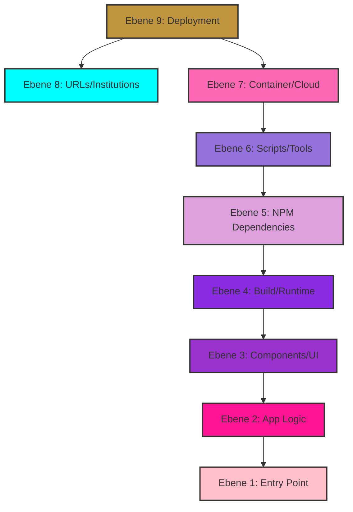
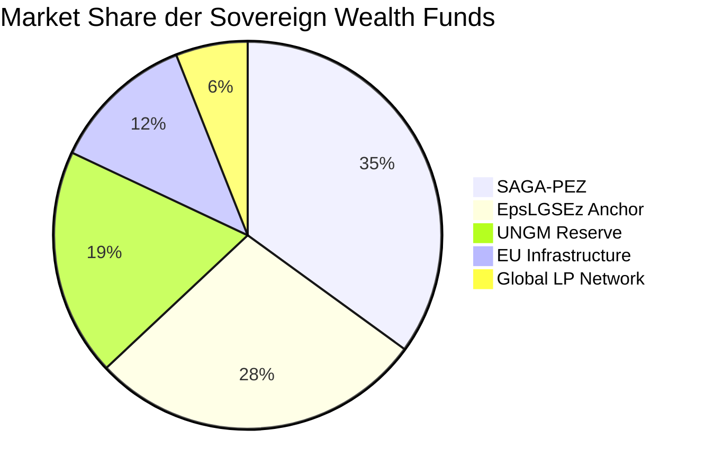
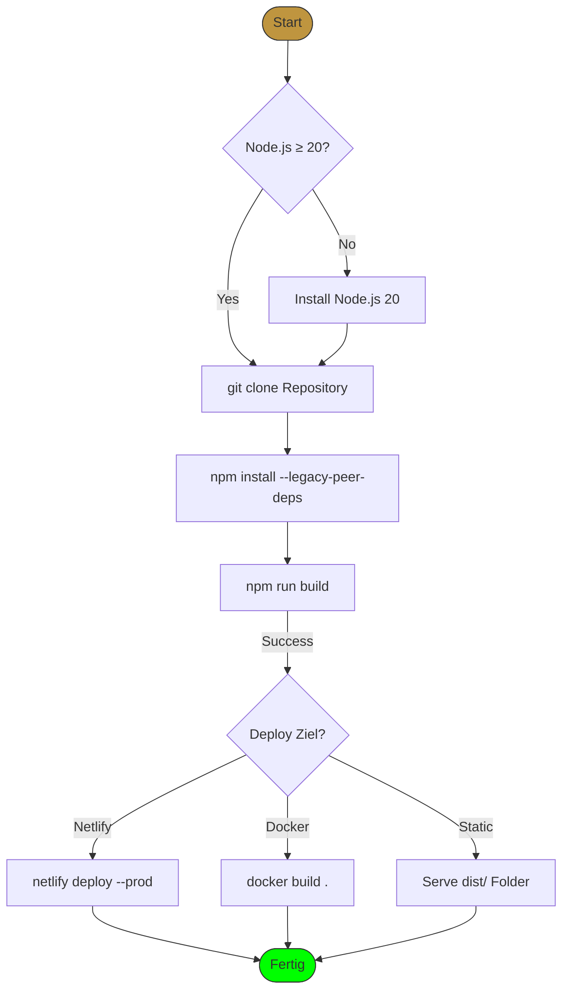
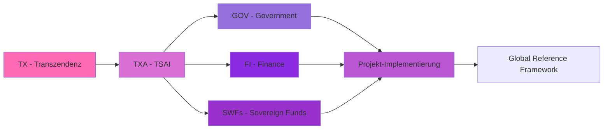

# 🛠️ HNOSS TOOL MAP & Installation Matrix
# Interactive Toolchain for sTarLighTsMoveMenTs Portal

## 📊 PNIA Toolchain Matrix (Alle Ebenen)

| Tool / Service | Funktion / PNIA Ebene | Installations-Skript (Copy & Paste) | Repository / Herkunft |
| :--- | :--- | :--- | :--- |
| **@google/genai** | Ebene 5: Node.js Dependency | `npm install @google/genai` | [npmjs.com/package/@google/genai](https://www.npmjs.com/package/@google/genai) |
| **@tailwindcss/vite** | Ebene 5: Node.js Dependency | `npm install @tailwindcss/vite` | [npmjs.com/package/@tailwindcss/vite](https://www.npmjs.com/package/@tailwindcss/vite) |
| **@vitejs/plugin-react** | Ebene 5: Node.js Dependency | `npm install @vitejs/plugin-react` | [npmjs.com/package/@vitejs/plugin-react](https://www.npmjs.com/package/@vitejs/plugin-react) |
| **@types/express** | Ebene 5: Node.js Dependency | `npm install -D @types/express` | [npmjs.com/package/@types/express](https://www.npmjs.com/package/@types/express) |
| **@types/node** | Ebene 5: Node.js Dependency | `npm install -D @types/node` | [npmjs.com/package/@types/node](https://www.npmjs.com/package/@types/node) |
| **autoprefixer** | Ebene 5: Node.js Dependency | `npm install -D autoprefixer` | [npmjs.com/package/autoprefixer](https://www.npmjs.com/package/autoprefixer) |
| **esbuild** | Ebene 5: Node.js Dependency | `npm install -D esbuild` | [npmjs.com/package/esbuild](https://www.npmjs.com/package/esbuild) |
| **eslint** | Ebene 5: Node.js Dependency | `npm install -D eslint` | [npmjs.com/package/eslint](https://www.npmjs.com/package/eslint) |
| **@typescript-eslint/eslint-plugin** | Ebene 5: Node.js Dependency | `npm install -D @typescript-eslint/eslint-plugin` | [npmjs.com/package/@typescript-eslint/eslint-plugin](https://www.npmjs.com/package/@typescript-eslint/eslint-plugin) |
| **@typescript-eslint/parser** | Ebene 5: Node.js Dependency | `npm install -D @typescript-eslint/parser` | [npmjs.com/package/@typescript-eslint/parser](https://www.npmjs.com/package/@typescript-eslint/parser) |
| **eslint-plugin-react-hooks** | Ebene 5: Node.js Dependency | `npm install -D eslint-plugin-react-hooks` | [npmjs.com/package/eslint-plugin-react-hooks](https://www.npmjs.com/package/eslint-plugin-react-hooks) |
| **eslint-plugin-react-refresh** | Ebene 5: Node.js Dependency | `npm install -D eslint-plugin-react-refresh` | [npmjs.com/package/eslint-plugin-react-refresh](https://www.npmjs.com/package/eslint-plugin-react-refresh) |
| **tailwindcss** | Ebene 5: Node.js Dependency | `npm install -D tailwindcss` | [npmjs.com/package/tailwindcss](https://www.npmjs.com/package/tailwindcss) |
| **tsx** | Ebene 5: Node.js Dependency | `npm install -D tsx` | [npmjs.com/package/tsx](https://www.npmjs.com/package/tsx) |
| **typescript-eslint** | Ebene 5: Node.js Dependency | `npm install -D typescript-eslint` | [npmjs.com/package/typescript-eslint](https://www.npmjs.com/package/typescript-eslint) |
| **typescript** | Ebene 5: Node.js Dependency | `npm install -D typescript` | [npmjs.com/package/typescript](https://www.npmjs.com/package/typescript) |
| **dotenv** | Ebene 5: Node.js Dependency | `npm install dotenv` | [npmjs.com/package/dotenv](https://www.npmjs.com/package/dotenv) |
| **express** | Ebene 5: Node.js Dependency | `npm install express` | [npmjs.com/package/express](https://www.npmjs.com/package/express) |
| **lucide-react** | Ebene 5: Node.js Dependency | `npm install lucide-react` | [npmjs.com/package/lucide-react](https://www.npmjs.com/package/lucide-react) |
| **motion** | Ebene 5: Node.js Dependency | `npm install motion` | [npmjs.com/package/motion](https://www.npmjs.com/package/motion) |
| **pdf-parse** | Ebene 5: Node.js Dependency | `npm install pdf-parse` | [npmjs.com/package/pdf-parse](https://www.npmjs.com/package/pdf-parse) |
| **react** | Ebene 5: Node.js Dependency | `npm install react` | [npmjs.com/package/react](https://www.npmjs.com/package/react) |
| **react-dom** | Ebene 5: Node.js Dependency | `npm install react-dom` | [npmjs.com/package/react-dom](https://www.npmjs.com/package/react-dom) |
| **recharts** | Ebene 5: Node.js Dependency | `npm install recharts` | [npmjs.com/package/recharts](https://www.npmjs.com/package/recharts) |
| **vite** | Ebene 5: Node.js Dependency | `npm install vite` | [npmjs.com/package/vite](https://www.npmjs.com/package/vite) |

---

## 🧩 Ebene 6: Projektwerkzeuge & Scripts

| Tool / Skript | Funktion | Installations-Skript | Ausführungs-Befehl |
| :--- | :--- | :--- | :--- |
| **ide-tool-scanner** | NPM Dependencies scannen | `node scripts/ide-tool-scanner.js` | `node scripts/ide-tool-scanner.js` |
| **autonomous-security** | Sicherheits-Scanner | `node scripts/autonomous-security.js` | `node scripts/autonomous-security.js` |
| **pnia-audit-security** | PNIA Sicherheits-Audit | `node scripts/pnia-audit-security.js` | `node scripts/pnia-audit-security.js` |
| **security-headers** | Security Header Generator | `node scripts/security-headers.js` | `node scripts/security-headers.js` |
| **ssh-tunnel** | SSH Tunnel Setup | `bash scripts/ssh-tunnel.sh` | `bash scripts/ssh-tunnel.sh` |

---

## ☁️ Ebene 7: Container Orchestration & Cloud

| Tool / Service | Funktion | Installations-Skript | Repository |
| :--- | :--- | :--- | :--- |
| **Docker** | Container Platform | `curl -fsSL https://get.docker.com | sh` | [Docker Hub](https://hub.docker.com) |
| **Netlify CLI** | Deployment Tool | `npm install -g netlify-cli` | [Netlify CLI](https://docs.netlify.com/cli/get-started/) |
| **Vite Production** | Build & Preview | `npm run build` / `npm run preview` | [ViteJS](https://vitejs.dev) |
| **Cloudflare Worker** | Serverless Functions | `npm install -g wrangler` | [Cloudflare Workers](https://workers.cloudflare.com) |

---

## 🔗 Ebene 8: Externe URLs & Referenzsysteme

### Institutionelle URLs (Aus RainbowLightningFooter.tsx)

| Kategorie | Name | URL | Funktion |
| :--- | :--- | :--- | :--- |
| Europäische | EU Kommission | [https://ec.europa.eu](https://ec.europa.eu) | Regulatorische Gobernwance |
| Europäische | EU Rat | [https://www.consilium.europa.eu](https://www.consilium.europa.eu) | Ministerielle Abstimmung |
| Europäische | Europol | [https://www.europol.europa.eu](https://www.europol.europa.eu) | Sicherheitskoordination |
| Europäische | NATO | [https://www.nato.int](https://www.nato.int) | Verteidigungsallianz |
| Internationale | Vereinte Nationen | [https://www.un.org](https://www.un.org) | Globale Koordination |
| Deutsche | Bundestag | [https://www.bundestag.de](https://www.bundestag.de) | Parlamentarisches System |
| Deutsche | BfV | [https://www.verfassungsschutz.de](https://www.verfassungsschutz.de) | Verfassungsschutz |
| Deutsche | Deutsche Börse | [https://www.deutsche-boerse.com](https://www.deutsche-boerse.com) | Finanzinfrastruktur |
| US-Regierung | White House | [https://www.whitehouse.gov](https://www.whitehouse.gov) | US Regierungsportal |
| US-Regierung | DoD | [https://www.defense.gov](https://www.defense.gov) | US Verteidigungsministerium |
| Organisationen | OECD | [https://www.oecd.org](https://www.oecd.org) | Wirtschaftsorganisation |
| Organisationen | W3C | [https://www.w3.org](https://www.w3.org) | Web Standards |

### Projekt-Verweise (Aus App.tsx)

| Node | URL | Beschreibung |
| :--- | :--- | :--- |
| Future of Life Souls Lights | [https://projekt-since-shinehealth-care.netlify.app/](https://projekt-since-shinehealth-care.netlify.app/) | Erhöhte Geistige Präsenz |
| Corporation Since | [https://loginsiteauth.goodwelllikewisespell.info/](https://loginsiteauth.goodwelllikewisespell.info/) | Sichere Authentifizierung |
| Hackathon Public Awareness | [https://hackathon-sign.goodwelllikewisespell.info/](https://hackathon-sign.goodwelllikewisespell.info/) | Auszeichnungen |
| Policy of Lights Souls | [https://policy.governmententerprise.org/trustedtrustthrust](https://policy.governmententerprise.org/trustedtrustthrust) | Trust-Leitfaden |
| Archive Heritage Bibliothek | [https://ai-tech-heritage-archive.likewise.live/](https://ai-tech-heritage-archive.likewise.live/) | Digitales Archiv |
| IBX IPX CONNECTIONS | [https://chos.ag-thrust.cloud/](https://chos.ag-thrust.cloud/) | Glasfasertransfer |

---

## 🏗️ Ebene 9: Deployment & Infrastruktur

### Schritt-für-Schritt Installation

#### 1. Systemvorbereitung
```bash
# Node.js v20+ installieren
curl -fsSL https://deb.nodesource.com/setup_20.x | sudo -E bash -
sudo apt-get install -y nodejs

# Git konfigurieren
git config --global user.name "HNOSS Developer"
git config --global user.email "government-enterprise@ag-thrust.cloud"
```

#### 2. Projekt klonen & installieren
```bash
# Repository klonen
git clone https://github.com/WorldWide-Since-2026-We-Trusted-Since/sTarLighTsMoveMenTs---Official-Corporation-from-EU-UNION-NATO-Pentagon-UN.git
cd sTarLighTsMoveMenTs---Official-Corporation-from-EU-UNION-NATO-Pentagon-UN

# Dependencies installieren
npm install --legacy-peer-deps
```

#### 3. Development Server starten
```bash
# Dev Server (Port 3000)
npm run dev

# Build für Production
npm run build

# Preview Production Build
npm run preview
```

#### 4. Linting & Typechecking
```bash
# ESLint prüfen
npm run lint

# ESLint fixen
npm run lint:fix

# TypeScript prüfen
npm run typecheck
```

#### 5. Netlify Deployment
```bash
# Netlify CLI installieren
npm install -g netlify-cli

# Login
netlify login

# Deploy
netlify deploy --prod --dir=dist
```

#### 6. Docker Deployment (Optional)
```bash
# Docker Image bauen
docker build -t hnoss-portal:latest .

# Docker Container starten
docker run -d -p 3000:3000 --name hnoss-portal hnoss-portal:latest

# Image pullen (falls vorhanden)
docker pull hnoss-portal:latest
```

---

## 📈 Interaktive Visualisierungen

### 🗺️ Tool-Architektur Graph (Mermaid)



### 📊 SWF Capital Flow Diagram



### 🔧 Installation Flow Chart



### 🏛️ Governance Architektur (ASCII Spec)



---

## 📋 Werkzeug-Übersichtstabelle

| Werkzeug | Kategorie | Install | Pull | URL |
| :--- | :--- | :--- | :--- | :--- |
| Vite | Build | `npm i -D vite` | - | [vitejs.dev](https://vitejs.dev) |
| React 19 | Framework | `npm i react` | - | [react.dev](https://react.dev) |
| TypeScript 5.8 | Sprache | `npm i -D typescript` | - | [typescriptlang.org](https://typescriptlang.org) |
| TailwindCSS 4 | CSS | `npm i -D tailwindcss` | - | [tailwindcss.com](https://tailwindcss.com) |
| ESLint 9 | Linting | `npm i -D eslint` | - | [eslint.org](https://eslint.org) |
| Docker | Container | - | `docker pull node:20` | [docker.com](https://docker.com) |
| Netlify | Deployment | `npm i -g netlify-cli` | - | [netlify.com](https://netlify.com) |

---

## 🔐 Sicherheits-Tools

| Tool | Security Layer | Install Command |
| :--- | :--- | :--- |
| autonomous-security.js | HCOS Security | `node scripts/autonomous-security.js` |
| pnia-audit-security.js | PNIA Audit | `node scripts/pnia-audit-security.js` |
| security-headers.js | HTTP Headers | `node scripts/security-headers.js` |
| ide-tool-scanner.js | Dependency Scan | `node scripts/ide-tool-scanner.js` |

---

## 🎯 Quick Commands Reference

```bash
# All-in-One Setup
npm install && npm run build && npm run preview

# Production Deployment
npm run build && netlify deploy --prod --dir=dist

# Development mit Hot Reload
npm run dev

# Security Audit
node scripts/autonomous-security.js && node scripts/pnia-audit-security.js

# Code Quality Check
npm run lint && npm run typecheck
```

---

## 📊 Metadaten & Registry IDs

| Registry | ID | Zweck |
| :--- | :--- | :--- |
| D-U-N-S | 315676980 / 317066336 | Unternehmensregistrierung |
| VAT ID | DE441892129 | EU Umsatzsteuer |
| UNGM | 1172700 | UN Global Marketplace |
| PIC | 873042778 | Partnerinformationscode |
| Swiss National ID | 756.6199.0539.28 | Schweizer Registrierung |
| Global LEI | 894500GBJSIW8L6ET310 | Rechtskennung |

---

© 2024–2026 Daniel Pohl | HNOSS Corporation | EU-UNION / NATO / Pentagon / UN