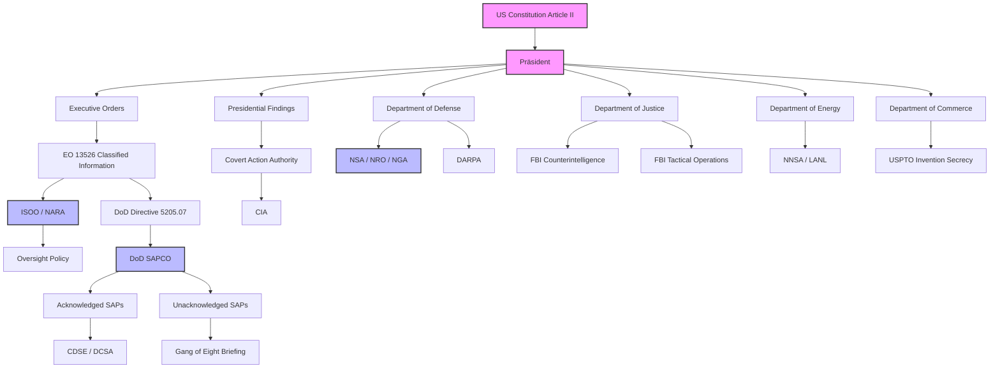
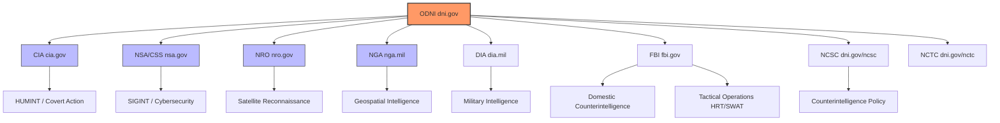
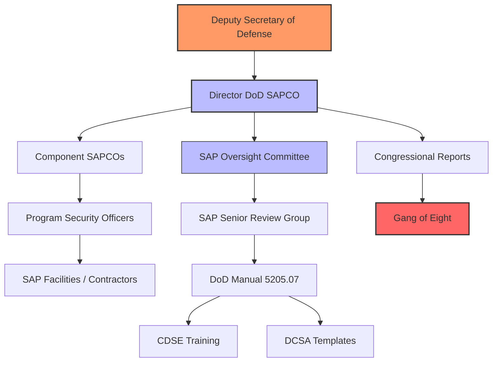
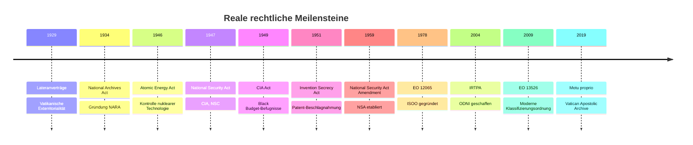
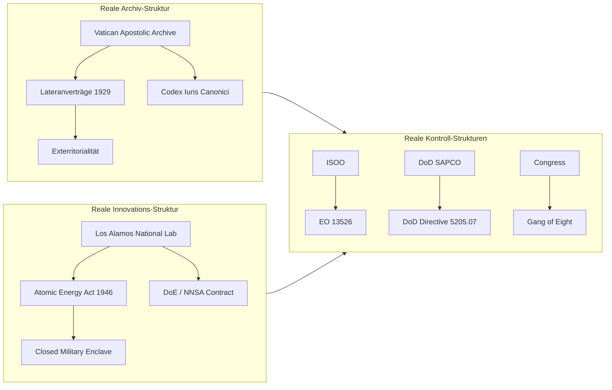
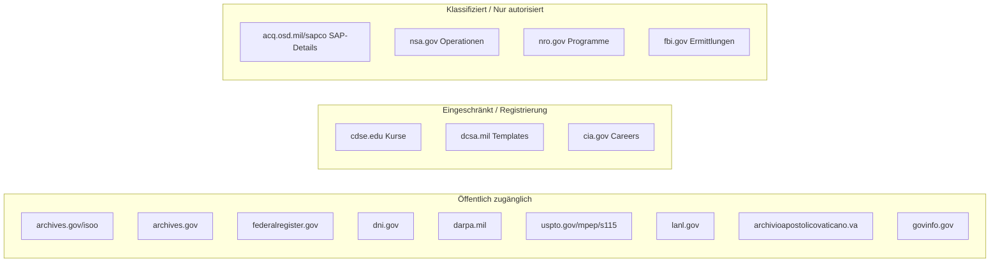
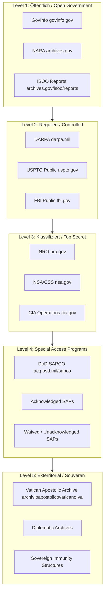

# URLs: Reale staatliche & staatsrechtliche Strukturen

**Dokument:** Nur reale, staatliche und völkerrechtlich/staatsrechtlich validierte Strukturen.  
**Zweck:** Navigation durch offizielle Regierungs- und Organisations-URLs mit ausführlichen staatsrechtlichen Beschreibungen, Mermaid-Diagrammen und Skalen.  
**Hinweis:** Keine fiktiven oder spekulativen Konzepte.  
**Erstellt:** 2026-06-29

---

## 1. Gesamtübersicht: Reale staatliche Strukturen und URLs

| Thema / Funktion | Organisation | Staat / Rechtsträger | URL | Rechts-/Normgrundlage | Kurzbeschreibung |
|---|---|---|---|---|---|
| Geheimhaltungs-Aufsicht | ISOO | USA (NARA) | [archives.gov/isoo](https://www.archives.gov/isoo) | EO 13526; EO 12829 | Regierungweite Klassifizierungsaufsicht |
| Bundesarchiv & Records | NARA | USA | [archives.gov](https://www.archives.gov) | National Archives Act 1934 | Archivierung und öffentlicher Zugang zu Bundesdokumenten |
| Klassifizierungs-EO | Federal Register | USA | [federalregister.gov/executive-order-13526](https://www.federalregister.gov/executive-order-13526) | EO 13526 | Einheitliches Klassifizierungssystem |
| DoD SAP-Zentrale | DoD SAPCO | USA (DoD) | [acq.osd.mil/sapco](https://www.acq.osd.mil/sapco/index.html) | DoD Directive 5205.07 | Verwaltung militärischer Special Access Programs |
| Sicherheitstraining | CDSE | USA (DCSA) | [cdse.edu](https://www.cdse.edu/) | DoDI 3305.13 | Zertifizierte Sicherheitsbildung |
| SAP-Vorlagen | DCSA | USA (DoD) | [dcsa.mil/Industrial-Security/Special-Access-Programs-Templates](https://www.dcsa.mil/Industrial-Security/Special-Access-Programs-Templates/) | DoD 5205.07 | SAP-Formulare und -Templates |
| DoD-Issuances | ESD | USA (DoD) | [esd.whs.mil](https://www.esd.whs.mil) | DoD 5025.01 | Offizielle DoD-Direktiven und -Manuals |
| Geheimdienst-Koordination | ODNI | USA | [dni.gov](https://www.dni.gov/) | IRTPA 2004 | Leitung des US Intelligence Community |
| Auslandsaufklärung | CIA | USA | [cia.gov](https://www.cia.gov/) | National Security Act 1947 | Auslandsgeheimdienst |
| SIGINT / Cyber | NSA/CSS | USA (DoD) | [nsa.gov](https://www.nsa.gov/) | DoD Directive 5100.20 | Kryptologie und Signals Intelligence |
| Satellitenaufklärung | NRO | USA (DoD/IC) | [nro.gov](https://www.nro.gov/) | 50 U.S.C. § 3058 | Spionagesatelliten-Behörde |
| Geodaten / GEOINT | NGA | USA (DoD) | [nga.mil](https://www.nga.mil/) | 10 U.S.C. § 467 | Geospatial Intelligence |
| Spionageabwehr Inland | FBI Counterintelligence | USA (DOJ) | [fbi.gov/investigate/counterintelligence](https://www.fbi.gov/investigate/counterintelligence) | Attorney General Guidelines | Inländische Spionageabwehr |
| Taktische Einsatzkräfte | FBI Tactical Operations | USA (DOJ) | [fbi.gov/how-we-investigate/tactics](https://www.fbi.gov/how-we-investigate/tactics) | FBI Operations Guide | HRT, SWAT, taktische Einheiten |
| Advanced R&D | DARPA | USA (DoD) | [darpa.mil](https://www.darpa.mil/) | DoD Directive 5134.10 | Transformationale Verteidigungsforschung |
| Patent-Geheimhaltung | USPTO | USA (Commerce) | [uspto.gov/mpep/s115](https://www.uspto.gov/web/offices/pac/mpep/s115.html) | 35 U.S.C. § 181–188 | Invention Secrecy Orders |
| Nukleare Sicherheit | NNSA | USA (DoE) | [energy.gov/nnsa](https://www.energy.gov/nnsa) | 50 U.S.C. § 2401 | Nukleare Waffen, Nonproliferation |
| Forschungslabor | LANL | USA (DoE/NNSA) | [lanl.gov](https://www.lanl.gov/) | Atomic Energy Act 1946 | National-Security-Forschung |
| Vatikanisches Archiv | Archivio Apostolico Vaticano | Heiliger Stuhl | [archivioapostolicovaticano.va](https://www.archivioapostolicovaticano.va/content/aav/en.html) | Lateranverträge 1929, Art. 3 | Exterritoriales Archiv |
| Bundesdokumente | GPO GovInfo | USA | [govinfo.gov](https://www.govinfo.gov/) | 44 U.S.C. § 4101 | Offizielle Veröffentlichung von Gesetzen |
| UN-Mitgliedsstaaten | UN | Vereinte Nationen | [un.org/en/member-states](https://www.un.org/en/member-states) | UN-Charta 1945 | Völkerrechtliche Mitgliedschaft |
| NATO | NATO | Internationale Organisation | [nato.int](https://www.nato.int/) | NATO-Vertrag 1949 | Verteidigungsbündnis |
| Europäische Union | EU | Supranationale Organisation | [european-union.europa.eu](https://european-union.europa.eu/) | EU-Verträge | Rechtsgemeinschaft |
| Weltbank | World Bank | Internationale Organisation | [data.worldbank.org/country](https://data.worldbank.org/country) | Bretton-Woods-Abkommen | Wirtschafts- und Entwicklungsdaten |
| CIA World Factbook | CIA | USA | [cia.gov/the-world-factbook](https://www.cia.gov/the-world-factbook/) | — | Staatsprofile weltweit |
| US-Außenministerium | State Department | USA | [state.gov/countries-areas](https://www.state.gov/countries-areas/) | — | Bilaterale Beziehungen |

---

## 2. Ausführliche staatsrechtliche Beschreibungen

### 2.1 Aufsicht & Klassifizierung

#### `archives.gov/isoo` — Information Security Oversight Office (ISOO)

- **Staatsrechtliche Stellung:** Ein Amt innerhalb der National Archives and Records Administration (NARA), das dem Präsidenten gegenüber zur Aufsicht über das Regierung-weite Sicherheitsklassifizierungssystem verantwortlich ist.
- **Rechtsgrundlagen:** Executive Order 13526 („Classified National Security Information“), Executive Order 12829 („National Industrial Security Program“), 32 CFR 2001–2004.
- **Aufgaben:** Überwachung der Original Classification, derivative Classification, Safeguarding, Marking, Declassification und des National Industrial Security Program (NISP).
- **Staatsrechtliche Bedeutung:** ISOO ist die zentrale Stelle, die sicherstellt, dass Exekutivbehörden die Vorgaben des Präsidenten zur Geheimhaltung einheitlich anwenden. Es berichtet über den Annual Report to the President.
- **Zugang:** Öffentliche Website; interne Prüfungen und Detaildaten sind naturgemäß geschützt.

#### `archives.gov` — National Archives and Records Administration (NARA)

- **Staatsrechtliche Stellung:** Unabhängige Bundesbehörde der USA für die Archivierung, Bewahrung und öffentliche Bereitstellung von Regierungsdokumenten.
- **Rechtsgrundlagen:** National Archives Act 1934, Presidential Records Act 1978, Federal Records Act 1950.
- **Aufgaben:** Dauerhafte Aufbewahrung von Bundesdokumenten; Betrieb des National Archives Catalog; Dachorganisation für ISOO und PIDB.
- **Staatsrechtliche Bedeutung:** NARA ist der gesetzliche Hüter der dokumentierten Geschichte der US-Bundesregierung und stellt durch die Transparenz der Aufzeichnungen ein Kontrollorgan der Exekutive dar.
- **Zugang:** Öffentlich; viele Dokumente digital verfügbar.

#### `federalregister.gov/executive-order-13526` — Executive Order 13526

- **Staatsrechtliche Stellung:** Präsidentielle Verordnung vom 29. Dezember 2009, die das gesamte System der nationalen Sicherheitsklassifizierung der USA regelt.
- **Rechtsgrundlage:** Artikel II der US-Verfassung (Präsidentielle Vollmacht als Oberbefehlshaber und Leiter der Exekutive).
- **Aufgaben:** Festlegung von Klassifizierungsstandards, -markierungen, Schutzmaßnahmen, Deklassifizierungsfristen und der Rolle von ISCAP, PIDB und ISOO.
- **Staatsrechtliche Bedeutung:** EO 13526 ist die maßgebliche Rechtsquelle für alle US-Behörden, die mit classified information arbeiten. Sie kann vom Präsidenten geändert oder ersetzt werden.
- **Zugang:** Volltext öffentlich verfügbar im Federal Register.

### 2.2 Verteidigungsministerium & Special Access Programs

#### `acq.osd.mil/sapco` — DoD Special Access Program Central Office (SAPCO)

- **Staatsrechtliche Stellung:** Büro im Office of the Under Secretary of Defense for Acquisition and Sustainment, das dem Deputy Secretary of Defense direkt berichtet.
- **Rechtsgrundlagen:** DoD Directive 5205.07; DoD Manual 5205.07; 10 U.S.C. 119.
- **Aufgaben:** Zentrale Verwaltung, Koordinierung und Kongress-Liaison für DoD Special Access Programs; SAP-Reports to Congress; Corporate Portfolio Program (CPP).
- **Staatsrechtliche Bedeutung:** SAPCO ist diejenige Stelle, die die Einrichtung und Überwachung der strengsten Kategorie militärischer Geheimprogramme innerhalb des DoD steuert.
- **Zugang:** Öffentliche Website; programmspezifische Informationen sind SAP-geschützt.

#### `cdse.edu` — Center for Development of Security Excellence (CDSE)

- **Staatsrechtliche Stellung:** Direktorat innerhalb der Defense Counterintelligence and Security Agency (DCSA).
- **Rechtsgrundlagen:** DoDI 3305.13; national akkreditiert durch ACE (American Council on Education).
- **Aufgaben:** Ausbildung, Zertifizierung und Weiterbildung für Sicherheitspersonal, cleared contractors und Regierungsbedienstete in SAP, Industrial Security, Counterintelligence.
- **Staatsrechtliche Bedeutung:** CDSE ist die zentrale Ausbildungsinstitution für das Personalsicherheits- und Geheimhaltungssystem des DoD.
- **Zugang:** Öffentliche Website; Kurse teilweise registrierungspflichtig.

#### `dcsa.mil/Industrial-Security/Special-Access-Programs-Templates` — DCSA SAP Templates

- **Staatsrechtliche Stellung:** Repository der Defense Counterintelligence and Security Agency für standardisierte SAP-Dokumente.
- **Rechtsgrundlagen:** DoD Manual 5205.07 (SAP Security Manual).
- **Aufgaben:** Bereitstellung von Formularen, Templates und Prozessdokumenten für SAP-Programmverantwortliche.
- **Staatsrechtliche Bedeutung:** Gewährleistet einheitliche Prozesse und Dokumentation in der Industrie-Sicherheit.
- **Zugang:** Öffentlich; Bearbeitung nur durch autorisierte Stellen.

#### `esd.whs.mil` — Executive Services Directorate (ESD)

- **Staatsrechtliche Stellung:** Direktorat im Office of the Secretary of Defense, zuständig für die offizielle Veröffentlichung aller DoD-Direktiven, -Instructions und -Manuals.
- **Rechtsgrundlagen:** DoD 5025.01 (DoD Directives Program).
- **Aufgaben:** Herausgabe, Archivierung und Versionierung von DoD 5205.07, DoDM 5205.07 etc.
- **Staatsrechtliche Bedeutung:** ESD ist die offizielle Rechtsquelle für die Schriftform aller DoD-Regelungen.
- **Zugang:** Öffentlich; PDF-Downloads direkt verfügbar.

### 2.3 Geheimdienste & Nachrichtendienstliche Koordination

#### `dni.gov` — Office of the Director of National Intelligence (ODNI)

- **Staatsrechtliche Stellung:** Unabhängige Bundesbehörde, die als Leiter des US Intelligence Community fungiert.
- **Rechtsgrundlagen:** National Security Act of 1947, as amended by Intelligence Reform and Terrorism Prevention Act (IRTPA) 2004; 50 U.S.C. § 3023.
- **Aufgaben:** Integration von 18 Geheimdienstbehörden; National Intelligence Program Budget; Richtlinien für Classification, Counterintelligence, Cyber.
- **Staatsrechtliche Bedeutung:** Der DNI ist der oberste Geheimdienstkoordinator und Hauptberater des Präsidenten für Nachrichtendienste.
- **Zugang:** Öffentliche Website; strategische Inhalte verfügbar, operative Details geschützt.

#### `cia.gov` — Central Intelligence Agency (CIA)

- **Staatsrechtliche Stellung:** Unabhängige US-Auslandsgeheimdienstbehörde.
- **Rechtsgrundlagen:** National Security Act 1947; 50 U.S.C. § 3033.
- **Aufgaben:** Sammlung ausländischer Nachrichten, all-source analysis, Covert Action auf Weisung des Präsidenten.
- **Staatsrechtliche Bedeutung:** Die CIA ist die zentrale ausländische Nachrichtendienstbehörde und für die Durchführung verdeckter Operationen zuständig, sofern der Präsident eine entsprechende Findings-Verordnung erlässt.
- **Zugang:** Öffentliche Website; operative Programme geheim.

#### `nsa.gov` — National Security Agency / Central Security Service (NSA/CSS)

- **Staatsrechtliche Stellung:** Kombinierte Organisation innerhalb des DoD für SIGINT und Cybersecurity.
- **Rechtsgrundlagen:** National Security Act 1959; DoD Directive 5100.20; 50 U.S.C. § 402.
- **Aufgaben:** Signals Intelligence, Information Assurance, Kryptologie, Cyber-Operationen.
- **Staatsrechtliche Bedeutung:** NSA/CSS ist die führende Behörde für technische Aufklärung und staatliche Kryptologie.
- **Zugang:** Öffentliche Website; technische und operative Details eingeschränkt.

### 2.4 Satelliten- & Geoint-Aufklärung

#### `nro.gov` — National Reconnaissance Office (NRO)

- **Staatsrechtliche Stellung:** DoD-Behörde und Mitglied der Intelligence Community für Satellitenaufklärung.
- **Rechtsgrundlagen:** 50 U.S.C. § 3058; National Reconnaissance Office Act (1992 öffentlich anerkannt).
- **Aufgaben:** Design, Bau, Start und Betrieb von Aufklärungssatelliten.
- **Staatsrechtliche Bedeutung:** NRO stellt die technische Infrastruktur für space-borne intelligence bereit.
- **Zugang:** Öffentliche Website; Programmdetails klassifiziert.

#### `nga.mil` — National Geospatial-Intelligence Agency (NGA)

- **Staatsrechtliche Stellung:** DoD Combat Support Agency für GEOINT.
- **Rechtsgrundlagen:** 10 U.S.C. § 467; National Defense Authorization Act 2004.
- **Aufgaben:** Auswertung von Satellitenbildern, Geodaten, Kartografie; Unterstützung von Militär und Diplomatie.
- **Staatsrechtliche Bedeutung:** NGA ist die zentrale GEOINT-Behörde der USA und verknüpft Raum-, Luft- und Bodenaufnahmen mit analytischen Produkten.
- **Zugang:** Öffentliche Website; unclassified Produkte verfügbar.

### 2.5 Strafverfolgung & Taktik

#### `fbi.gov/investigate/counterintelligence` — FBI Counterintelligence Division

- **Staatsrechtliche Stellung:** Division des FBI im Department of Justice für inländische Spionageabwehr.
- **Rechtsgrundlagen:** Attorney General Guidelines; 18 U.S.C. § 793 ff. (Espionage Act).
- **Aufgaben:** Schutz kritischer Technologien, Aufspüren ausländischer Geheimdienstaktivitäten, Sabotageprävention.
- **Staatsrechtliche Bedeutung:** FBI ist die führende inländische Behörde für Counterintelligence und nationalen Geheimnisschutz.
- **Zugang:** Öffentliche Website; Ermittlungsdetails geheim.

#### `fbi.gov/how-we-investigate/tactics` — FBI Tactical Operations

- **Staatsrechtliche Stellung:** Taktische Einheiten des FBI für hochriskante Einsätze.
- **Rechtsgrundlagen:** FBI Operations Guide; DOJ-Authorization.
- **Aufgaben:** Hostage Rescue Team (HRT), Bureau SWAT, Mobilität und taktische Unterstützung.
- **Staatsrechtliche Bedeutung:** HRT ist die einzige Vollzeit-Counterterrorism-Einheit der US-Bundesstrafverfolgung.
- **Zugang:** Öffentliche Website; taktische Details eingeschränkt.

### 2.6 Forschung, Patente & Nuklear-Sicherheit

#### `darpa.mil` — Defense Advanced Research Projects Agency (DARPA)

- **Staatsrechtliche Stellung:** Forschungsbehörde des DoD.
- **Rechtsgrundlagen:** DoD Directive 5134.10; 10 U.S.C. § 2358.
- **Aufgaben:** Hochrisiko-Forschung für transformative militärische Technologien.
- **Staatsrechtliche Bedeutung:** DARPA fördert Technologien, die dem US-Militär strategische Überraschungsvorteile verschaffen.
- **Zugang:** Öffentliche Website; einzelne Programme können SAP-geschützt sein.

#### `uspto.gov/mpep/s115` — USPTO Invention Secrecy

- **Staatsrechtliche Stellung:** Richtlinie des US Patent and Trademark Office.
- **Rechtsgrundlagen:** Invention Secrecy Act 1951; 35 U.S.C. § 181–188.
- **Aufgaben:** Überprüfung von Patentanmeldungen auf nationale Sicherheitsrelevanz; Verwaltung von Secrecy Orders.
- **Staatsrechtliche Bedeutung:** Staatliche Möglichkeit, Patente und wissenschaftliche Entdeckungen einzufrieren, wenn sie die nationale Sicherheit berühren.
- **Zugang:** Öffentliche Richtlinie; konkrete Secrecy Orders klassifiziert.

#### `energy.gov/nnsa` — National Nuclear Security Administration (NNSA)

- **Staatsrechtliche Stellung:** Semi-autonome Agentur innerhalb des Department of Energy.
- **Rechtsgrundlagen:** National Nuclear Security Administration Act; 50 U.S.C. § 2401.
- **Aufgaben:** Nukleare Waffenreserve, Nonproliferation, Reaktorsicherheit, Notfallreaktion.
- **Staatsrechtliche Bedeutung:** NNSA verwaltet die gesamte zivile und militärische Nuklearinfrastruktur der USA.
- **Zugang:** Öffentliche Website; technische Details teilweise classified.

#### `lanl.gov` — Los Alamos National Laboratory (LANL)

- **Staatsrechtliche Stellung:** Federalfinanziertes Forschungslabor unter DoE/NNSA.
- **Rechtsgrundlagen:** Atomic Energy Act 1946; DoE/NNSA-Contract.
- **Aufgaben:** Multidisziplinäre National-Security-Forschung; historisches Zentrum des Manhattan-Projekts.
- **Staatsrechtliche Bedeutung:** LANL ist das wichtigste US-Labor für Nuklearwaffenforschung und zahlreiche nationale Sicherheitsthemen.
- **Zugang:** Öffentliche Website; geschützte Forschungsbereiche restricted.

### 2.7 Historische / Reale Archive

#### `archivioapostolicovaticano.va` — Vatican Apostolic Archive

- **Staatsrechtliche Stellung:** Zentrales Archiv des Heiligen Stuhls auf exterritorialem Gebiet des Vatikans.
- **Rechtsgrundlagen:** Lateranverträge 1929, Art. 3; Codex Iuris Canonici; Motu proprio „Praecipuum“ 2019.
- **Aufgaben:** Bewahrung des Privatarchivs des Papstes; limitierter Zugang für anerkannte Forscher.
- **Staatsrechtliche Bedeutung:** Das Archiv ist ein reales Beispiel für einen autarken, exterritorialen Rechtsraum, der keiner zivilen italienischen oder internationalen Gerichtsbarkeit unterliegt.
- **Zugang:** Öffentliche Website; physischer Archivzugang streng limitiert.

#### `govinfo.gov` — U.S. Government Publishing Office (GPO) GovInfo

- **Staatsrechtliche Stellung:** Offizielle Veröffentlichungsplattform der US-Regierung.
- **Rechtsgrundlagen:** 44 U.S.C. § 4101.
- **Aufgaben:** Dauerhafte, öffentliche Bereitstellung von Gesetzen, Verordnungen, Kongressakten, Executive Orders, Gerichtsentscheidungen.
- **Staatsrechtliche Bedeutung:** GPO/GovInfo ist die autoritative Quelle für das authentic, digitalisierte Bundesrecht.
- **Zugang:** Öffentlich und kostenlos.

---

## 3. Mermaid-Diagramme reale staatlicher Strukturen

### 3.1 Mindmap: Reale staatliche Strukturen

```mermaid
mindmap
  root((Reale staatliche Strukturen))
    US Exekutive
      Praesident[Präsident / Art. II]
        EO[Executive Orders]
          EO13526[EO 13526 Klassifizierung]
      Nationaler Sicherheitsrat
      ODNI[dni.gov]
    Legislative Kontrolle
      Kongress
        GangOfEight["Gang of Eight" SAP-Briefing]
        Geheimdienstausschuesse
    Gerichtliche Kontrolle
      FISC[Foreign Intelligence Surveillance Court]
      Bundesgerichte
    Aufsicht
      ISOO[archives.gov/isoo]
      NARA[archives.gov]
      GPO[govinfo.gov]
    Verteidigung
      DoD
        SAPCO[acq.osd.mil/sapco]
        CDSE[cdse.edu]
        DCSA[dcsa.mil]
        DARPA[darpa.mil]
        NSA[nsa.gov]
        NRO[nro.gov]
        NGA[nga.mil]
    Strafverfolgung
      DOJ
        FBI[fbi.gov]
          CI[fbi.gov/counterintelligence]
          TACT[fbi.gov/tactics]
    Forschung
      DoE
        NNSA[energy.gov/nnsa]
        LANL[lanl.gov]
      Commerce
        USPTO[uspto.gov/mpep/s115]
    Internationale Rechtsraeume
      Vatikan[archivioapostolicovaticano.va]
      UN[un.org]
      NATO[nato.int]
      EU[european-union.europa.eu]
```

### 3.2 Flussdiagramm: Von der Verfassung zum Betrieb



### 3.3 US Intelligence Community Struktur



### 3.4 DoD SAP Governance Struktur



### 3.5 Skala: Reale Geheimhaltungs- und Zugangsstufen

```mermaid
graph LR
    A[Public / Unclassified] --> B[CUI Controlled Unclassified Information]
    B --> C[Confidential]
    C --> D[Secret]
    D --> E[Top Secret]
    E --> F[SCI Sensitive Compartmented Information]
    F --> G[SAP Special Access Program]
    G --> H[Waived / Unacknowledged SAP]
    
    style A fill:#9f9
    style B fill:#ff9
    style C fill:#fc9
    style D fill:#f96
    style E fill:#f66
    style F fill:#c00,color:#fff
    style G fill:#900,color:#fff
    style H fill:#600,color:#fff
```



### 3.6 Timeline: Reale rechtliche Meilensteine



### 3.7 Vergleich: Reale Archiv- vs. Innovations-Strukturen



### 3.8 URL-Zugriffsmatrix: Öffentlich, Eingeschränkt, Klassifiziert



---

## 4. Reale Strukturen im Detail

### 4.1 Validierbare staatliche Strukturen

| Struktur | Reale Entsprechung | Rechtsgrundlage | URL |
|---|---|---|---|
| Exterritorialer Rechtsraum | Vatikanische Exterritorialität | Lateranverträge 1929, Art. 3 | [archivioapostolicovaticano.va](https://www.archivioapostolicovaticano.va/content/aav/en.html) |
| Geschlossene Forschungsstadt | Los Alamos / NNSA-Labore | Atomic Energy Act 1946 | [lanl.gov](https://www.lanl.gov/) |
| Staatliche Patent-Beschlagnahmung | Invention Secrecy | 35 U.S.C. § 181–188 | [uspto.gov/mpep/s115](https://www.uspto.gov/web/offices/pac/mpep/s115.html) |
| Klassifizierter Haushalt | Black Budget / SAPs | CIA Act 1949; DoD Directive 5205.07 | [cia.gov](https://www.cia.gov/), [acq.osd.mil/sapco](https://www.acq.osd.mil/sapco/index.html) |
| Geheimdienst-Koordination | ODNI / Intelligence Community | IRTPA 2004 | [dni.gov](https://www.dni.gov/) |
| Operative Immunität bei genehmigten Aktionen | Attorney General Guidelines / Covert Action | National Security Act 1947 | [fbi.gov/investigate/counterintelligence](https://www.fbi.gov/investigate/counterintelligence) |

---

## 5. Skalenmodell: Reale staatliche Geheimhaltungshierarchie



---

## 6. Zusammenfassung: Navigation nach staatsrechtlichem Thema

| Wenn Sie suchen nach... | Dann starten Sie bei... |
|---|---|
| Geheimhaltungsvorschriften & Klassifizierung | [archives.gov/isoo](https://www.archives.gov/isoo) |
| Volltext EO 13526 | [federalregister.gov/executive-order-13526](https://www.federalregister.gov/executive-order-13526) |
| DoD Special Access Programs | [acq.osd.mil/sapco](https://www.acq.osd.mil/sapco/index.html) |
| SAP-Training & Zertifizierung | [cdse.edu](https://www.cdse.edu/) |
| Geheimdienst-Koordination | [dni.gov](https://www.dni.gov/) |
| Auslandsaufklärung | [cia.gov](https://www.cia.gov/) |
| SIGINT / Cyber | [nsa.gov](https://www.nsa.gov/) |
| Satellitenaufklärung | [nro.gov](https://www.nro.gov/) |
| Geodaten / GEOINT | [nga.mil](https://www.nga.mil/) |
| Spionageabwehr im Inland | [fbi.gov/investigate/counterintelligence](https://www.fbi.gov/investigate/counterintelligence) |
| Taktische Einsatzkräfte | [fbi.gov/how-we-investigate/tactics](https://www.fbi.gov/how-we-investigate/tactics) |
| Advanced R&D | [darpa.mil](https://www.darpa.mil/) |
| Patent-Geheimhaltung | [uspto.gov/mpep/s115](https://www.uspto.gov/web/offices/pac/mpep/s115.html) |
| Nukleare Sicherheit | [energy.gov/nnsa](https://www.energy.gov/nnsa) |
| Forschungslabor | [lanl.gov](https://www.lanl.gov/) |
| Exterritoriales Archiv | [archivioapostolicovaticano.va](https://www.archivioapostolicovaticano.va/content/aav/en.html) |
| Offizielle US-Dokumente | [govinfo.gov](https://www.govinfo.gov/) |
| UN-Mitgliedsstaaten | [un.org/en/member-states](https://www.un.org/en/member-states) |
| NATO | [nato.int](https://www.nato.int/) |

---

**Erstellt am:** 2026-06-29  
**Dokumententyp:** Reale staatliche URL-Map, Mermaid-Diagramme, staatsrechtliche Navigation  
**Validierungsprinzip:** Nur offizielle, staatliche oder staatlich anerkannte Quellen; keine fiktiven Konzepte.
